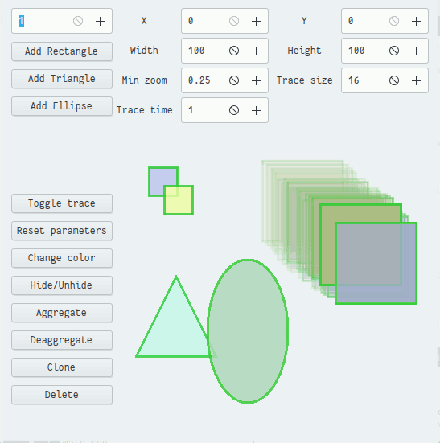

# Звіт з лабораторної роботи №3<br/>за дисципліною "Програмування II"<br/>студента групи ПА-17-1<br/>Панасенка Єгора Сергійовича<br/>Кафедра комп'ютерних технологій<br/>ФПМ, ДНУ, 2017-2018 навч.р.

## Постановка задачі

Скласти об'єктно-орієнтовану програму на мові C++, яка в діалоговому режимі керує графічними об’єктами, що відображаються на екрані дисплею. По натисненню клавіши F1 програма виводить на екран коротку підказку по усіх наявних командах/клавішах; наприклад: як створити об'єкт, як зрушити з місця, як перейти до «наступного» об'єкту тощо.

Програма повинна підтримувати такі загальні елементи поведінки графічних об'єктів:

1. Активізація/візуалізація графічного об'єкту за вибором користувача.
2. Переміщення зі слідом/без.
3. Відновлення початкового стану об'єкту.
4. Зміна кольору.
5. Зміна стану видимий/невидимий.
6. Агрегація, тобто утворення нових об'єктів з вже створених. При агрегації об'єктів забезпечити можливість агрегації агрегатів.

Програма повинна надати користувачеві можливість зберігати поточну конфігурацію програми у вказаний користувачем текстовий файл на диску і завантажувати поточну конфігурацію програми із вказаного користувачем текстового файлу на диску. 

Індивідуальні варіанти завдань
Варіанти поведінки об'єктів.

1. Ім'я конфігураційного файлу:<br/>
    0 - задане у командному рядку при запуску програми.
2. Рух об’єкта в автоматичному режимі:<br/>
    1- По запам'ятованій траєкторії.
3. Зміна кольору:<br/>
    1 - Під впливом іншого об'єкта.
4. Деформація образу:<br/>
    1 - Під впливом іншого об'єкта.
5. Збирання/запам'ятовування агрегованого образу:<br/>
    0 - Дублюванням об'єктів, з яких будується агрегат.

Варіанти графічних образів пропонується згенерувати самостійно на основі таких графічних примітивів: точка, відрізок, трикутник, прямокутник, коло, зірка. Наприклад: кільце; зірка, вписана в коло; коло, вписане в трикутник, сузір'я і та ін. Під час здавання роботи викладачеві слід очікувати на пропозицію додати до програми графічний об'єкт нової форми.

## Опис розв’язку

Ця лабораторна робота розроблялася на бібліотеці GTKMM.

Опис вихідних файлів:

1. CMakeLists.txt - для компіляції за допомогою CMake
2. main.ui - задається графічний інтерфейс
3. main.cpp - запускає програму
4. window.{h,cpp} -  задає поведінку графічного інтерфейсу
5. graphics.{h,cpp} - допоміжні класи для обробки фігур
6. shape-parameters.{h,cpp} - ініціований глобально клас для налаштувань
7. shapes.{h,cpp} - базовий клас фігури та контейнеру з фігурами
8. shape-childs.{h,cpp} - класи фігур
9. aggregator.{h,cpp} - клас агрегатор

Файли з пункту 1 до 6 є допоміжними для роботи інтерфейсу і не відносяться до постановки задачі напряму, тому ми не будемо їх описувати. А пункти 7-9 безпосередньо реалізують постановку задачі.

### Опис файлу shapes.h

У цьому файлі задаються класи:

1. ShapeTrace - реалізує слід фігури за допомогою її дублювання.
2. Shape - реалізує саму фігуру з всіма параметрами.
3. Shapes - реалізує контейнер для фігур.
4. Shapes::Element - зберігає та оброблює фігуру з її слідом.

#### Клас ShapeTrace

##### Поля

1. `std::shared_ptr<Shape> shape_;` - зберігає вказівник на фігуру
2. `std::vector< std::shared_ptr<Shape> > queue_;` - зберігає вказівники на дубльовані фігури, які утворюють слід.
3. `unsigned char tail_;` - індекс останнього елемента у queue_
4. `clock_t time_;` - час останнього додавання нової фігури у queue_

##### Функції

1. `ShapeTrace(std::shared_ptr<Shape> pointer);`
    1. Конструктор з параметром.
    2. Має єдиний аргумент pointer - вказівник на фігуру.
    3. Нічого не виводить.
2. `ShapeTrace(const ShapeTrace&) = default;` - стандартний конструктор копіювання.
3. `ShapeTrace(ShapeTrace&&) noexcept = default;` - стандартний конструктор переносу.
4. `~ShapeTrace();` - деструктор
5. `static std::shared_ptr<ShapeTrace> create(const std::shared_ptr<Shape>& pointer);`
    1. Динамічно створює об'єкт сліду.
    2. Має єдиний аргумент pointer - вказівник на фігуру.
    3. Виводить вказівник на слід.
6. `ShapeTrace& operator=(const ShapeTrace&) = default;` - стандартний оператор присвоювання з копіюванням.
7. `ShapeTrace& operator=(ShapeTrace&&) = default;` - стандартний оператор присвоювання з переносом.
8. `void draw(const Cairo::RefPtr<Cairo::Context>& context, bool selected);`
    1. Малює слід фігури і раз у деякий час дублює фігуру для створення сліду.
    2. Аргументи:
        1. context - вказівник на клас для малювання.
        2. selected - вказує чи виділена фігура.
    3. Нічого не виводить.

#### Клас Shape

##### Поля

1. `Point position_;` - поточна позиція фігури
2. `Size size_;` - поточний розмір фігури
3. `float zoom_;` - поточне наближення фігури при деформації
4. `Color defaultColor_;` - початковий колір
5. `Color color_;` - поточний колір
6. `std::vector<Point> path_;` - траєкторія фігури для автоматичного руху
7. `std::vector<Point>::iterator currentPathPoint_;` - поточна позиція фігури при автоматичному русі
8. `clock_t time_;` - час останьої зміни позиції при автоматичному русі
9. `bool automove_;` - чи рухається фігура автоматично
10. `bool directionPath_;` - задає напрямок зміни позиції при автоматичному русі.  Якщо true, то зміна позиції йде вперед по path_, якщо false, то в зворотньому напряму.
11. `bool recordPath_;` - задає чи записується траєкторія при русі фігура мишкою по екрані
12. `bool visible_;` - задає видимість фігури
13. `bool trace_;` - чи має фігура слід

##### Функції

1. `Shape();` - конструктор.
2. `Shape(const Shape& shape);` - конструктор копіювання.
3. `Shape(Shape&&) = default;` - стандартний конструктор переносу.
4. `Shape& operator=(const Shape&) = default;` - стандартний оператор присвоювання з копіюванням.
5. `Shape& operator=(Shape&&) = default;` - стандартний оператор присвоювання з переносом.
6. `virtual ~Shape();` - віртуальний деструктор для поліморфізму.
7. `virtual const std::string getClassNameVirtual() const;` - віртуальна функція яка забирає назву поточної фігури для збереження у файл.
8. `virtual void drawShape(const Cairo::RefPtr<Cairo::Context>& context, bool selected, float alpha = 0.8f);`
    1. Вірнуальна функція, яка малює поточну фігуру.
    2. Аргументи:
        1. context - вказівник на клас для малювання.
        2. selected - вказує чи виділена фігура.
    3. Нічого не виводить.
9. `virtual const std::shared_ptr<Shape> cloneVirtual();` - віртуальна функція для клонування фігури. Виводить розумний вказівник на нову фігуру
10. `virtual bool isInShapeVirtual(const Point& p) const;` - перевіряє чи знаходиться точка у поточній фігурі.
11. `virtual std::ostream& outputVirtual(std::ostream& out) const;` - виводить данні поточної фігури у потік.
12. `virtual std::istream& inputVirtual(std::istream& in);` - вводить данні поточної фігури з потоку.
13. `const std::shared_ptr<Shape> clone();` - клонує фігуру за допомогою функції cloneVirtual, а якщо не вдалося, то виводить пустий вказівник.
14. `void render(bool selected);` - при selected = true деформує фігуру відносно краю екрану, а також реалізує автоматичний рух.
15. `bool areIntersected(const std::shared_ptr<Shape>& shape, bool wasIntersected);` - перевіряє чи перетинається поточна фігура з фігурою shape та деформує поточну фігуру, якщо ці фігури не перетиналися у попередній ітерації, а зараз так, то змінює колір. Під перетинаються мається на увазі, якщо центр фігури shape лежить у поточній фігурі.
16. `void draw(const Cairo::RefPtr<Cairo::Context>& context, bool selected, float alpha = 0.8f);` - малює фігуру з прозорістю alpha і червоною рамою якщо selected = true. Прозорість використовується тільки при сліді.
17. `bool isInShape(const Point& point) const;` - перевіряє чи знаходиться точка у поточній фігурі. Спочатку перевіряє грубо, те що точка знаходиться у квадраті описаного навколо фігури, а потім використовує isInShapeVirtual.
18. `const Point& getPosition() const;` - забирає поточну позицію фігури.
19. `void setPosition(const Point& position);` - задає позицію фігури.
20. `const Size& getSize() const;` - забирає розмір фігури.
21. `void setSize(const Size& size);` - задає розмір фігури.
22. `void setSizeForce(const Size& size);` - задає розмір фігури без перевірки на мінімальний і максимальний розмір.
23. `float getZoom() const;` - забирає наближення фігури.
24. `void setZoom(float zoom);` - задає наближення фігури.
25. `void toggleVisibility();` - перемикає видимість фігури.
26. `void changeColor();` - змінює колір на випадковий.
27. `void reset();` - повертає всі параметри на початкові.
28. `bool hasTrace();` - перевіряє чи має фігура слід.
29. `void toggleTrace();` - перемикає слід фігури.
30. `void toggleAutomove();` - перемикає автоматичний рух фігури.
31. `void clearPath();` - затирає траєкторію руху.
32. `void startRecordingPath();` - починає записувати траєкторію.
33. `void stopRecordingPath();` - закінчує записувати траєкторію.
34. `friend std::ostream& operator <<(std::ostream& out, const Shape& rhs);` - оператор виводу фігури у потік.
35. `friend std::istream& operator >>(std::istream& in,  Shape& rhs);` - оператор вводу фігури з потоку.

#### Клас Shapes

##### Поля

1. `std::vector<Element> array_;` - зберігає фігури.
2. `std::vector< std::vector<bool> > intersected_;` - матриця, яка зберігає перетин фігури на попередній ітерації малювання.
3. `std::vector< std::shared_ptr<Shape> > selected_;` - зберігає вибрані фігури.
4. `bool activated_;` - чи утримується елемент лівою кнопкою миші.
5. `Point activationPoint_;` - точка натиснення лівої кнопки миші відносно фігури.

##### Функції


1. `Shapes();` - конструктор.
2. `std::vector<Element>::iterator getActiveIterator();` - забирає ітератор активної фігури.
3. `std::shared_ptr<Shape> getActive();` - забирає активну фігуру.
4. `std::vector<Element>::iterator getTopIterator(const Point& point);` - забирає ітератор верхньої фігури, що знаходиться к точці point.
5. `std::shared_ptr<Shape> getTop(const Point& point);` - виводить фігуру з ітератора getTopIterator().
6. `void add(const std::shared_ptr<Shape>& pointer);` - додає нову фігуру.
7. `void erase(const std::vector<Element>::iterator& iterator);` - видаляє нову фігуру.
8. `void toggleSelection(const std::vector<Element>::iterator& iterator);` - перемикає виділеність
9. `void activate(const Point& p);` - активує переміщення фігури за допомогою миші, функція виконується при натисненні лівої кнопки миші і запам'ятовує позицію миші відносно фігури яку рухають.
10. `void moveActive(const Point& p);` - переміщує фігуру через рух миші.
12. `void release();` - перестає реагувати на рух миші.
13. `void render();` - підготовлює фігури до малювання.
14. `void draw(const Cairo::RefPtr<Cairo::Context>& context);` - малює фігури на екрані
15. `const std::vector< std::shared_ptr<Shape> > getSelected();` - забирає виділенні елементи для агрегування.
16. `friend std::ostream& operator<<(std::ostream& out, const Shapes& rhs);` - оператор виводу у потік, зберігає всі фігури.
17. `friend std::istream& operator>>(std::istream& in,  Shapes& rhs);` - оператор вводу з потоку, завантажує всі фігури.

#### Клас Shapes::Element

##### Поля

1. `std::shared_ptr<Shape> pointer_;` - розумний вказівник на поточну фігуру.
2. `std::shared_ptr<ShapeTrace> shapeTrace_;` - розумний вказівник на слід фігури.
3. `bool selected_;` - чи виділений елемент.

##### Функції

1. `Element(std::shared_ptr<Shape> pointer);` - конструктор з параметром pointer, вказівником на поточну фігуру.
2. `const std::shared_ptr<Shape>& operator*() const;` - повертає вказівник на поточну фігуру.
3. `Shape* operator->();` - оператор доступу до членів класу фігури.
4. `void draw(const Cairo::RefPtr<Cairo::Context>& context);` - малює фігуру з її слідом.
5. `operator bool() const;` - перевіряє чи вказує елемент на якусь фігуру.
6. `bool isSelected() const;` - перевіряє чи виділена фігура.
7. `void toggleSelection();` - перемикає виділеність

### Опис файлу shape-childs.h

У цьому файлі задаються класи:

1. Triangle - реалізується фігура трикутник.
2. Rectangle - реалізується фігура прямокутник.
3. Ellipse - реалізується фігура еліпс.

#### Клас Triangle

##### Функції

1. `static const std::string getClassName();` - виводить назву фігури: "Triangle".
2. `const std::string getClassNameVirtual() const override;` - виводить результат функції getClassName().
3. `static const std::shared_ptr<Shape> create();` - створює новий трикутник.
4. `const std::shared_ptr<Shape> cloneVirtual() override;` - клонує трикутник.
5. `void drawShape(const Cairo::RefPtr<Cairo::Context>& context, bool selected, float alpha = 0.8f) override;` - малює трикутник.
6. `bool isInShapeVirtual(const Point& p) const override;` - перевіряє чи знаходиться точка у трикутнику.

#### Клас Rectangle

##### Функції

1. `static const std::string getClassName();` - виводить назву фігури: "Rectangle".
2. `const std::string getClassNameVirtual() const override;` - виводить результат функції getClassName().
3. `static const std::shared_ptr<Shape> create();` - створює новий прямокутник.
4. `const std::shared_ptr<Shape> cloneVirtual() override;` - клонує прямокутник.
5. `void drawShape(const Cairo::RefPtr<Cairo::Context>& context, bool selected, float alpha = 0.8f) override;` - малює прямокутник.
6. `bool isInShapeVirtual(const Point& p) const override;` - перевіряє чи знаходиться точка у прямокутнику.

#### Клас Ellipse

##### Функції

1. `static const std::string getClassName();` - виводить назву фігури: "Ellipse".
2. `const std::string getClassNameVirtual() const override;` - виводить результат функції getClassName().
3. `static const std::shared_ptr<Shape> create();` - створює новий еліпс.
4. `const std::shared_ptr<Shape> cloneVirtual() override;` - клонує еліпс.
5. `void drawShape(const Cairo::RefPtr<Cairo::Context>& context, bool selected, float alpha = 0.8f) override;` - малює еліпс.
6. `bool isInShapeVirtual(const Point& p) const override;` - перевіряє чи знаходиться точка у еліпсі.

### Опис файлу aggregator.h

У цьому файлі задається єдиний клас Aggregator для реалізації агрегації.

#### Клас Aggregator

##### Поля

1. `std::vector< std::shared_ptr<Shape> > array_;` - масив агрегованих фігур.

##### Функції

1. `Aggregator(std::vector< std::shared_ptr<Shape> > array);` - 
2. `Aggregator(const Aggregator& object);` - конструктор копіювання, клонує всі фігури в агрегаті.
3. `Aggregator(Aggregator&& object) = default;` - стандартний конструктор переносу.
4. `~Aggregator() override = default;` - стандартний деструктор.
5. `Aggregator& operator=(const Aggregator& object);` - оператор присвоювання з копіюванням, клонує всі фігури в агрегаті.
6. `Aggregator& operator=(Aggregator&& object) = default;` - стандартний оператор присвоювання з переносом.
7. `static const std::string getClassName();` - виводить назву фігури: "Aggregator".
8. `const std::string getClassNameVirtual() const override;` - виводить результат функції getClassName().
9. `static const std::shared_ptr<Shape> create(const std::vector< std::shared_ptr<Shape> >& array);` - створює новий агрегат з фігур.
10. `static const std::shared_ptr<Shape> create();` - створює пустий агрегат.
11. `const std::shared_ptr<Shape> cloneVirtual() override;` - клонує агрегат фігур.
12. `void drawShape(const Cairo::RefPtr<Cairo::Context>& context, bool selected, float alpha = 0.8f) override;` - малює агрегат фігур.
13. `bool isInShapeVirtual(const Point& p) const override;` - перевіряє чи знаходиться точка у агрегаті фігур.
14. `std::ostream& outputVirtual(std::ostream& out) const override;` - виводить фігури в агрегаті.
15. `std::istream& inputVirtual(std::istream& in) override;` - вводить фігури в агрегат.
16. `const std::vector< std::shared_ptr<Shape> > deaggregate();` - розділяє агрегат на окремі фігури.

## Опис іинтерфейсу

Програма може працювати з декількома фігурами (трикутники, прямокутники та кола) виконуючи такі дії

1. Створення кілька нових фігур
2. Клонування
3. Видалення
5. Зміна кольору на поточній фігурі
4. Зміна видимості фігури
6. Задавання параметрів за замовчуванням
7. Ввімкнення ти вимкнення сліду фігури
8. Зміна кольору при перетині
9. Зміна розміру при перетині з краєм екрану та іншої фігури
10. Зміна розміру за допомогою прокрутки миші
11. Агрегування і деагрегування фігури
12. Переміщення фігур за допомогою миші
13. Збереження на диск та завантаження з диску фігур
14. Автоматичний рух

## Опис тестових прикладів

Знімок роботи програми:



## Вихідний текст програми розв’язку задачі

### Файл [CMakeLists.txt](CMakeLists.txt)

```cmake
cmake_minimum_required(VERSION 3.0) # setting this is required
project(143)                        # this sets the project name
set(CMAKE_CXX_STANDARD 11)
set(CMAKE_CXX_FLAGS_DEBUG "${CMAKE_CXX_FLAGS_DEBUG} -DDEBUG")

###############################################################################
## file globbing ##############################################################
###############################################################################

# These instructions search the directory tree when cmake is
# invoked and put all files that match the pattern in the variables
# `sources` and `data`.
file(GLOB_RECURSE sources      src/*.cpp src/*.h)
file(GLOB_RECURSE data resources/*)
# You can use set(sources src/main.cpp) etc if you don't want to
# use globbing to find files automatically.

###############################################################################
## target definitions #########################################################
###############################################################################

# The data is just added to the executable, because in some IDEs (QtCreator)
# files are invisible when they are not explicitly part of the project.
add_executable(${PROJECT_NAME} ${sources} ${data})

# Just for example add some compiler flags.
target_compile_options(${PROJECT_NAME} PUBLIC -Wall)

# This allows to include files relative to the root of the src directory with a <> pair
target_include_directories(${PROJECT_NAME} PUBLIC src/main)

# This copies all resource files in the build directory.
# We need this, because we want to work with paths relative to the executable.
file(COPY ${data} DESTINATION resources)

###############################################################################
## dependencies ###############################################################
###############################################################################

# GTKMM
find_package(PkgConfig)
pkg_check_modules(GTKMM gtkmm-3.0)
#find_package(GTKMM REQUIRED)
include_directories(${GTKMM_INCLUDE_DIRS})

find_package(Threads)

target_link_libraries(${PROJECT_NAME} PUBLIC
  ${GTKMM_LIBRARIES}
  ${CMAKE_THREAD_LIBS_INIT}
)

###############################################################################
## packaging ##################################################################
###############################################################################

# All install commands get the same destination. this allows us to use paths
# relative to the executable.
install(TARGETS ${PROJECT_NAME} DESTINATION share/${PROJECT_NAME})

# This is basically a repeat of the file copy instruction that copies the
# resources in the build directory, but here we tell cmake that we want it
# in the package.
install(DIRECTORY resources DESTINATION share/${PROJECT_NAME})

# Now comes everything we need, to create a package
# there are a lot more variables you can set, and some
# you need to set for some package types, but we want to
# be minimal here.
set(CPACK_PACKAGE_NAME ${PROJECT_NAME})
set(CPACK_PACKAGE_VERSION "1.0.0")

# We don't want to split our program up into several incomplete pieces.
set(CPACK_MONOLITHIC_INSTALL 1)

# This must be last
include(CPack)
```

### Файл [ui/main.ui](ui/main.ui)

```xml
<?xml version="1.0" encoding="UTF-8"?>
<!-- Generated with glade 3.20.0 -->
<interface>
  <requires lib="gtk+" version="3.20"/>
  <object class="GtkAdjustment" id="height_adjustment">
    <property name="upper">1000</property>
    <property name="value">100</property>
    <property name="step_increment">1</property>
    <property name="page_increment">10</property>
  </object>
  <object class="GtkAdjustment" id="minimum_zoom_adjustment">
    <property name="upper">1</property>
    <property name="value">0.25</property>
    <property name="step_increment">0.01</property>
    <property name="page_increment">0.10000000000000001</property>
  </object>
  <object class="GtkAdjustment" id="n_adjustment">
    <property name="lower">1</property>
    <property name="upper">100</property>
    <property name="value">1</property>
    <property name="step_increment">1</property>
    <property name="page_increment">10</property>
  </object>
  <object class="GtkAdjustment" id="trace_size_adjustment">
    <property name="upper">255</property>
    <property name="value">16</property>
    <property name="step_increment">2</property>
    <property name="page_increment">8</property>
  </object>
  <object class="GtkAdjustment" id="trace_time_adjustment">
    <property name="upper">10000</property>
    <property name="value">1</property>
    <property name="step_increment">1</property>
    <property name="page_increment">10</property>
  </object>
  <object class="GtkAdjustment" id="width_adjustment">
    <property name="upper">1000</property>
    <property name="value">100</property>
    <property name="step_increment">1</property>
    <property name="page_increment">10</property>
  </object>
  <object class="GtkAdjustment" id="x_adjustment">
    <property name="upper">10000</property>
    <property name="step_increment">1</property>
    <property name="page_increment">10</property>
  </object>
  <object class="GtkAdjustment" id="y_adjustment">
    <property name="upper">10000</property>
    <property name="step_increment">1</property>
    <property name="page_increment">10</property>
  </object>
  <object class="GtkApplicationWindow" id="main_window">
    <property name="can_focus">False</property>
    <property name="default_width">200</property>
    <property name="default_height">200</property>
    <child>
      <object class="GtkBox">
        <property name="visible">True</property>
        <property name="can_focus">False</property>
        <property name="orientation">vertical</property>
        <child>
          <object class="GtkBox">
            <property name="visible">True</property>
            <property name="can_focus">False</property>
            <property name="border_width">10</property>
            <property name="spacing">5</property>
            <child>
              <object class="GtkBox">
                <property name="visible">True</property>
                <property name="can_focus">False</property>
                <property name="orientation">vertical</property>
                <property name="spacing">10</property>
                <child>
                  <object class="GtkBox">
                    <property name="visible">True</property>
                    <property name="can_focus">False</property>
                    <property name="orientation">vertical</property>
                    <property name="spacing">10</property>
                    <child>
                      <object class="GtkButton" id="save_button">
                        <property name="label" translatable="yes">Save</property>
                        <property name="visible">True</property>
                        <property name="can_focus">True</property>
                        <property name="receives_default">True</property>
                      </object>
                      <packing>
                        <property name="expand">False</property>
                        <property name="fill">True</property>
                        <property name="position">0</property>
                      </packing>
                    </child>
                    <child>
                      <object class="GtkButton" id="load_button">
                        <property name="label" translatable="yes">Load</property>
                        <property name="visible">True</property>
                        <property name="can_focus">True</property>
                        <property name="receives_default">True</property>
                      </object>
                      <packing>
                        <property name="expand">False</property>
                        <property name="fill">True</property>
                        <property name="position">1</property>
                      </packing>
                    </child>
                  </object>
                  <packing>
                    <property name="expand">False</property>
                    <property name="fill">True</property>
                    <property name="position">1</property>
                  </packing>
                </child>
                <child>
                  <object class="GtkSpinButton">
                    <property name="visible">True</property>
                    <property name="can_focus">True</property>
                    <property name="adjustment">n_adjustment</property>
                  </object>
                  <packing>
                    <property name="expand">False</property>
                    <property name="fill">True</property>
                    <property name="position">2</property>
                  </packing>
                </child>
                <child>
                  <object class="GtkBox">
                    <property name="visible">True</property>
                    <property name="can_focus">False</property>
                    <property name="orientation">vertical</property>
                    <property name="spacing">10</property>
                    <child>
                      <object class="GtkButton" id="add_rectangle_button">
                        <property name="label" translatable="yes">Add Rectangle</property>
                        <property name="visible">True</property>
                        <property name="can_focus">True</property>
                        <property name="receives_default">True</property>
                      </object>
                      <packing>
                        <property name="expand">False</property>
                        <property name="fill">True</property>
                        <property name="position">0</property>
                      </packing>
                    </child>
                    <child>
                      <object class="GtkButton" id="add_triangle_button">
                        <property name="label" translatable="yes">Add Triangle</property>
                        <property name="visible">True</property>
                        <property name="can_focus">True</property>
                        <property name="receives_default">True</property>
                      </object>
                      <packing>
                        <property name="expand">False</property>
                        <property name="fill">True</property>
                        <property name="position">1</property>
                      </packing>
                    </child>
                    <child>
                      <object class="GtkButton" id="add_ellipse_button">
                        <property name="label" translatable="yes">Add Ellipse</property>
                        <property name="visible">True</property>
                        <property name="can_focus">True</property>
                        <property name="receives_default">True</property>
                      </object>
                      <packing>
                        <property name="expand">False</property>
                        <property name="fill">True</property>
                        <property name="position">2</property>
                      </packing>
                    </child>
                  </object>
                  <packing>
                    <property name="expand">False</property>
                    <property name="fill">True</property>
                    <property name="position">3</property>
                  </packing>
                </child>
                <child>
                  <object class="GtkBox">
                    <property name="visible">True</property>
                    <property name="can_focus">False</property>
                    <property name="orientation">vertical</property>
                    <property name="spacing">10</property>
                    <child>
                      <object class="GtkButton" id="automove_button">
                        <property name="label" translatable="yes">Automove</property>
                        <property name="visible">True</property>
                        <property name="can_focus">True</property>
                        <property name="receives_default">True</property>
                      </object>
                      <packing>
                        <property name="expand">False</property>
                        <property name="fill">True</property>
                        <property name="position">0</property>
                      </packing>
                    </child>
                    <child>
                      <object class="GtkButton" id="trace_button">
                        <property name="label" translatable="yes">Toggle trace</property>
                        <property name="visible">True</property>
                        <property name="can_focus">True</property>
                        <property name="receives_default">True</property>
                      </object>
                      <packing>
                        <property name="expand">False</property>
                        <property name="fill">True</property>
                        <property name="position">1</property>
                      </packing>
                    </child>
                    <child>
                      <object class="GtkButton" id="reset_button">
                        <property name="label" translatable="yes">Reset parameters</property>
                        <property name="visible">True</property>
                        <property name="can_focus">True</property>
                        <property name="receives_default">True</property>
                      </object>
                      <packing>
                        <property name="expand">False</property>
                        <property name="fill">True</property>
                        <property name="position">2</property>
                      </packing>
                    </child>
                    <child>
                      <object class="GtkButton" id="color_button">
                        <property name="label" translatable="yes">Change color</property>
                        <property name="visible">True</property>
                        <property name="can_focus">True</property>
                        <property name="receives_default">True</property>
                      </object>
                      <packing>
                        <property name="expand">False</property>
                        <property name="fill">True</property>
                        <property name="position">3</property>
                      </packing>
                    </child>
                    <child>
                      <object class="GtkButton" id="visibility_button">
                        <property name="label" translatable="yes">Hide/Unhide</property>
                        <property name="visible">True</property>
                        <property name="can_focus">True</property>
                        <property name="receives_default">True</property>
                      </object>
                      <packing>
                        <property name="expand">False</property>
                        <property name="fill">True</property>
                        <property name="position">4</property>
                      </packing>
                    </child>
                    <child>
                      <object class="GtkButton" id="aggregate_button">
                        <property name="label" translatable="yes">Aggregate</property>
                        <property name="visible">True</property>
                        <property name="can_focus">True</property>
                        <property name="receives_default">True</property>
                      </object>
                      <packing>
                        <property name="expand">False</property>
                        <property name="fill">True</property>
                        <property name="position">5</property>
                      </packing>
                    </child>
                    <child>
                      <object class="GtkButton" id="deaggregate_button">
                        <property name="label" translatable="yes">Deaggregate</property>
                        <property name="visible">True</property>
                        <property name="can_focus">True</property>
                        <property name="receives_default">True</property>
                      </object>
                      <packing>
                        <property name="expand">False</property>
                        <property name="fill">True</property>
                        <property name="position">6</property>
                      </packing>
                    </child>
                    <child>
                      <object class="GtkButton" id="clone_button">
                        <property name="label" translatable="yes">Clone</property>
                        <property name="visible">True</property>
                        <property name="can_focus">True</property>
                        <property name="receives_default">True</property>
                      </object>
                      <packing>
                        <property name="expand">False</property>
                        <property name="fill">True</property>
                        <property name="position">7</property>
                      </packing>
                    </child>
                    <child>
                      <object class="GtkButton" id="delete_button">
                        <property name="label" translatable="yes">Delete</property>
                        <property name="visible">True</property>
                        <property name="can_focus">True</property>
                        <property name="receives_default">True</property>
                      </object>
                      <packing>
                        <property name="expand">True</property>
                        <property name="fill">True</property>
                        <property name="position">8</property>
                      </packing>
                    </child>
                  </object>
                  <packing>
                    <property name="expand">False</property>
                    <property name="fill">True</property>
                    <property name="pack_type">end</property>
                    <property name="position">4</property>
                  </packing>
                </child>
              </object>
              <packing>
                <property name="expand">False</property>
                <property name="fill">True</property>
                <property name="position">0</property>
              </packing>
            </child>
            <child>
              <object class="GtkBox">
                <property name="visible">True</property>
                <property name="can_focus">False</property>
                <property name="orientation">vertical</property>
                <child>
                  <object class="GtkGrid">
                    <property name="visible">True</property>
                    <property name="can_focus">False</property>
                    <property name="row_spacing">5</property>
                    <property name="column_spacing">10</property>
                    <child>
                      <object class="GtkLabel">
                        <property name="visible">True</property>
                        <property name="can_focus">False</property>
                        <property name="label" translatable="yes">X</property>
                      </object>
                      <packing>
                        <property name="left_attach">0</property>
                        <property name="top_attach">0</property>
                      </packing>
                    </child>
                    <child>
                      <object class="GtkLabel">
                        <property name="visible">True</property>
                        <property name="can_focus">False</property>
                        <property name="label" translatable="yes">Y</property>
                      </object>
                      <packing>
                        <property name="left_attach">2</property>
                        <property name="top_attach">0</property>
                      </packing>
                    </child>
                    <child>
                      <object class="GtkSpinButton">
                        <property name="visible">True</property>
                        <property name="can_focus">True</property>
                        <property name="hexpand">True</property>
                        <property name="adjustment">x_adjustment</property>
                      </object>
                      <packing>
                        <property name="left_attach">1</property>
                        <property name="top_attach">0</property>
                      </packing>
                    </child>
                    <child>
                      <object class="GtkSpinButton">
                        <property name="visible">True</property>
                        <property name="can_focus">True</property>
                        <property name="hexpand">True</property>
                        <property name="adjustment">y_adjustment</property>
                      </object>
                      <packing>
                        <property name="left_attach">3</property>
                        <property name="top_attach">0</property>
                      </packing>
                    </child>
                    <child>
                      <object class="GtkSpinButton">
                        <property name="visible">True</property>
                        <property name="can_focus">True</property>
                        <property name="adjustment">width_adjustment</property>
                      </object>
                      <packing>
                        <property name="left_attach">1</property>
                        <property name="top_attach">1</property>
                      </packing>
                    </child>
                    <child>
                      <object class="GtkSpinButton">
                        <property name="visible">True</property>
                        <property name="can_focus">True</property>
                        <property name="adjustment">height_adjustment</property>
                      </object>
                      <packing>
                        <property name="left_attach">3</property>
                        <property name="top_attach">1</property>
                      </packing>
                    </child>
                    <child>
                      <object class="GtkLabel">
                        <property name="visible">True</property>
                        <property name="can_focus">False</property>
                        <property name="label" translatable="yes">Width</property>
                      </object>
                      <packing>
                        <property name="left_attach">0</property>
                        <property name="top_attach">1</property>
                      </packing>
                    </child>
                    <child>
                      <object class="GtkLabel">
                        <property name="visible">True</property>
                        <property name="can_focus">False</property>
                        <property name="label" translatable="yes">Height</property>
                      </object>
                      <packing>
                        <property name="left_attach">2</property>
                        <property name="top_attach">1</property>
                      </packing>
                    </child>
                    <child>
                      <object class="GtkLabel">
                        <property name="visible">True</property>
                        <property name="can_focus">False</property>
                        <property name="label" translatable="yes">Min zoom</property>
                      </object>
                      <packing>
                        <property name="left_attach">0</property>
                        <property name="top_attach">2</property>
                      </packing>
                    </child>
                    <child>
                      <object class="GtkLabel">
                        <property name="visible">True</property>
                        <property name="can_focus">False</property>
                        <property name="label" translatable="yes">Trace size</property>
                      </object>
                      <packing>
                        <property name="left_attach">2</property>
                        <property name="top_attach">2</property>
                      </packing>
                    </child>
                    <child>
                      <object class="GtkLabel">
                        <property name="visible">True</property>
                        <property name="can_focus">False</property>
                        <property name="label" translatable="yes">Trace time</property>
                      </object>
                      <packing>
                        <property name="left_attach">0</property>
                        <property name="top_attach">3</property>
                      </packing>
                    </child>
                    <child>
                      <object class="GtkSpinButton">
                        <property name="visible">True</property>
                        <property name="can_focus">True</property>
                        <property name="adjustment">minimum_zoom_adjustment</property>
                        <property name="digits">2</property>
                      </object>
                      <packing>
                        <property name="left_attach">1</property>
                        <property name="top_attach">2</property>
                      </packing>
                    </child>
                    <child>
                      <object class="GtkSpinButton">
                        <property name="visible">True</property>
                        <property name="can_focus">True</property>
                        <property name="adjustment">trace_size_adjustment</property>
                      </object>
                      <packing>
                        <property name="left_attach">3</property>
                        <property name="top_attach">2</property>
                      </packing>
                    </child>
                    <child>
                      <object class="GtkSpinButton">
                        <property name="visible">True</property>
                        <property name="can_focus">True</property>
                        <property name="adjustment">trace_time_adjustment</property>
                      </object>
                      <packing>
                        <property name="left_attach">1</property>
                        <property name="top_attach">3</property>
                      </packing>
                    </child>
                    <child>
                      <placeholder/>
                    </child>
                    <child>
                      <placeholder/>
                    </child>
                  </object>
                  <packing>
                    <property name="expand">False</property>
                    <property name="fill">True</property>
                    <property name="position">0</property>
                  </packing>
                </child>
                <child>
                  <object class="GtkDrawingArea" id="drawing_area">
                    <property name="width_request">350</property>
                    <property name="height_request">350</property>
                    <property name="visible">True</property>
                    <property name="can_focus">False</property>
                  </object>
                  <packing>
                    <property name="expand">True</property>
                    <property name="fill">True</property>
                    <property name="position">1</property>
                  </packing>
                </child>
              </object>
              <packing>
                <property name="expand">True</property>
                <property name="fill">True</property>
                <property name="position">1</property>
              </packing>
            </child>
          </object>
          <packing>
            <property name="expand">True</property>
            <property name="fill">True</property>
            <property name="position">0</property>
          </packing>
        </child>
        <child>
          <object class="GtkStatusbar" id="statusbar">
            <property name="visible">True</property>
            <property name="can_focus">False</property>
            <property name="margin_left">10</property>
            <property name="margin_right">10</property>
            <property name="margin_start">10</property>
            <property name="margin_end">10</property>
            <property name="margin_top">6</property>
            <property name="margin_bottom">6</property>
            <property name="orientation">vertical</property>
            <property name="spacing">2</property>
          </object>
          <packing>
            <property name="expand">False</property>
            <property name="fill">True</property>
            <property name="position">4</property>
          </packing>
        </child>
      </object>
    </child>
  </object>
</interface>
```

### Файл [src/main.cpp](src/main.cpp)

```cpp
/***************************************************************
 * Name:      main.cpp
 * Purpose:   Main file to start program
 * Author:    Egor Panasenko (gaura.panasenko@gmail.com)
 * Created:   2019-01-20
 * Copyright: Egor Panasenko (elfiny.top)
 * License:   GPLv3
 **************************************************************/
#include "window.h"
#include <gtkmm/main.h>
#include <glibmm/fileutils.h>
#include <iostream>

/* For testing propose use the local (not installed) ui file */
/* #define UI_FILE PACKAGE_DATA_DIR"/ui/main.ui" */
#define UI_FILE "resources/main.ui"

int main (int argc, char *argv[]) {
  Gtk::Main kit(argc, argv);


  // Load the Glade file and instiate its widgets:
  Glib::RefPtr<Gtk::Builder> builder;
  try {
    builder = Gtk::Builder::create_from_file(UI_FILE);
  } catch (const Glib::FileError & ex) {
    std::cerr << ex.what() << std::endl;
    return 1;
  }

  Window* window = nullptr;
  builder->get_widget_derived("main_window", window);
  if (window) {
    Gtk::Main::run(*window);
  }
  delete window;

  return 0;
}
```

### Файл [src/window.h](src/window.h)

```cpp
/***************************************************************
 * Name:      window.h
 * Purpose:   Declaration of Window
 * Author:    Egor Panasenko (gaura.panasenko@gmail.com)
 * Created:   2019-01-20
 * Copyright: Egor Panasenko (elfiny.top)
 * License:   GPLv3
 **************************************************************/
#ifndef WINDOW_H
#define WINDOW_H

#include "shapes.h"

#include <gtkmm/applicationwindow.h>
#include <gtkmm/builder.h>
#include <gtkmm/drawingarea.h>
#include <gtkmm/statusbar.h>
#include <gtkmm/button.h>
#include <gtkmm/adjustment.h>
#include <glibmm/dispatcher.h>

#include <thread>
#include <mutex>

class Timer
{
public:
  Timer(Glib::Dispatcher& dispatcher);
  void doWork();
  void stop();

private:
  Glib::Dispatcher& dispatcher_;
  std::mutex mutex;
  bool continue_;
};

class Window : public Gtk::ApplicationWindow {
public:
  Window(BaseObjectType* cobject, Glib::RefPtr<Gtk::Builder> builder);
  ~Window() override;

  void quit[[noreturn]]();

private:
  Window(const Window&);
  Window operator=(const Window&);
  Window(const Window&&) noexcept;
  Window operator=(const Window&&) noexcept;
  void update();
  void thread();
  bool draw(const Cairo::RefPtr<Cairo::Context>& context);
  void parametersChanged();
  void save();
  void load();
  void addRectangle();
  void addTriangle();
  void addEllipse();
  void toggleAutomove();
  void toggleTrace();
  void reset();
  void changeColor();
  void hideOrShow();
  void aggregate();
  void deaggregate();
  void cloneShape();
  void deleteShape();
  bool activate(GdkEventButton* event);
  bool moveActive(GdkEventMotion* event);
  bool release(GdkEventButton* event);
  bool scrollZoom(GdkEventScroll* event);

  Glib::RefPtr<Gtk::Builder>     builder_;
  Glib::RefPtr<Gtk::Adjustment>  nAdjustment_;
  Glib::RefPtr<Gtk::Adjustment>  xAdjustment_;
  Glib::RefPtr<Gtk::Adjustment>  yAdjustment_;
  Glib::RefPtr<Gtk::Adjustment>  widthAdjustment_;
  Glib::RefPtr<Gtk::Adjustment>  heightAdjustment_;
  Glib::RefPtr<Gtk::Adjustment>  minimumZoomAdjustment_;
  Glib::RefPtr<Gtk::Adjustment>  traceSizeAdjustment_;
  Glib::RefPtr<Gtk::Adjustment>  traceTimeAdjustment_;
  Glib::RefPtr<Gtk::DrawingArea> drawingArea_;
  Glib::RefPtr<Gtk::Statusbar>   statusbar_;
  Shapes shapes_;
  Glib::Dispatcher dispatcher;
  Timer timer;
  std::thread* thread_;
};

#endif //WINDOW_H
```

### Файл [src/window.cpp](src/window.cpp)

```cpp
/***************************************************************
 * Name:      window.cpp
 * Purpose:   Definition of Window
 * Author:    Egor Panasenko (gaura.panasenko@gmail.com)
 * Created:   2019-01-20
 * Copyright: Egor Panasenko (elfiny.top)
 * License:   GPLv3
 **************************************************************/
#include "window.h"
#include "shape-childs.h"
#include "aggregator.h"
#include <gtkmm/filechooserdialog.h>
#include <fstream>
#include <chrono>
#include <thread>
#include <ctime>

Timer::Timer(Glib::Dispatcher& dispatcher)
  : dispatcher_(dispatcher), continue_(true) {}

void Timer::doWork() {
  bool c = true;
  while(c) {
    {
      std::lock_guard<std::mutex> lock(mutex);
      c = continue_;
    }
    std::this_thread::sleep_for(std::chrono::milliseconds(10));
    dispatcher_.emit();
  }
}

void Timer::stop() {
  std::lock_guard<std::mutex> lock(mutex);
  continue_ = false;
}

template<class T>
void getObject(const Glib::RefPtr<Gtk::Builder>& builder,
               Glib::RefPtr<T>& pointer, const char* name) {
  pointer = Glib::RefPtr<T>::cast_dynamic(builder->get_object(name));
  if (!pointer) exit(1);
}

template<class A, class B>
void connectButton(const Glib::RefPtr<Gtk::Builder>& builder,
                   const char* name, A& object, B function) {
  Glib::RefPtr<Gtk::Button> tmp;
  getObject(builder, tmp, name);
  tmp->signal_clicked().connect(sigc::mem_fun(object, function));
}

Window::Window(BaseObjectType* cobject,
               Glib::RefPtr<Gtk::Builder> builder)
  : Gtk::ApplicationWindow(cobject), builder_(std::move(builder)),
    timer(dispatcher), thread_(nullptr) {
  connectButton(builder_, "save_button"         , *this, &Window::save);
  connectButton(builder_, "load_button"         , *this, &Window::load);

  connectButton(builder_, "add_rectangle_button", *this, &Window::addRectangle);
  connectButton(builder_, "add_triangle_button" , *this, &Window::addTriangle );
  connectButton(builder_, "add_ellipse_button"  , *this, &Window::addEllipse  );

  connectButton(builder_, "trace_button"        , *this, &Window::toggleTrace );
  connectButton(builder_, "reset_button"        , *this, &Window::reset       );
  connectButton(builder_, "color_button"        , *this, &Window::changeColor );
  connectButton(builder_, "visibility_button"   , *this, &Window::hideOrShow  );
  connectButton(builder_, "aggregate_button"    , *this, &Window::aggregate   );
  connectButton(builder_, "deaggregate_button"  , *this, &Window::deaggregate );
  connectButton(builder_, "clone_button"        , *this, &Window::cloneShape  );
  connectButton(builder_, "delete_button"       , *this, &Window::deleteShape );
  connectButton(builder_, "automove_button"   , *this, &Window::toggleAutomove);

  getObject(builder_, drawingArea_, "drawing_area");
  getObject(builder_, statusbar_, "statusbar");


  getObject(builder_, nAdjustment_          , "n_adjustment");
  getObject(builder_, xAdjustment_          , "x_adjustment");
  getObject(builder_, yAdjustment_          , "y_adjustment");
  getObject(builder_, widthAdjustment_      , "width_adjustment");
  getObject(builder_, heightAdjustment_     , "height_adjustment");
  getObject(builder_, minimumZoomAdjustment_, "minimum_zoom_adjustment");
  getObject(builder_, traceSizeAdjustment_  , "trace_size_adjustment");
  getObject(builder_, traceTimeAdjustment_  , "trace_time_adjustment");

  auto mfpc = sigc::mem_fun(*this, &Window::parametersChanged);
            xAdjustment_->signal_value_changed().connect(mfpc);
            yAdjustment_->signal_value_changed().connect(mfpc);
        widthAdjustment_->signal_value_changed().connect(mfpc);
       heightAdjustment_->signal_value_changed().connect(mfpc);
  minimumZoomAdjustment_->signal_value_changed().connect(mfpc);
    traceSizeAdjustment_->signal_value_changed().connect(mfpc);
    traceTimeAdjustment_->signal_value_changed().connect(mfpc);

  drawingArea_->add_events(
        Gdk::BUTTON_PRESS_MASK | Gdk::BUTTON_MOTION_MASK |
        Gdk::BUTTON_RELEASE_MASK | Gdk::SCROLL_MASK);
  this->add_events(Gdk::KEY_PRESS_MASK | Gdk::KEY_RELEASE_MASK);

  auto mfd = sigc::mem_fun(*this, &Window::draw);
  auto mfa = sigc::mem_fun(*this, &Window::activate);
  auto mfm = sigc::mem_fun(*this, &Window::moveActive);
  auto mfr = sigc::mem_fun(*this, &Window::release);
  auto mfs = sigc::mem_fun(*this, &Window::scrollZoom);

  drawingArea_->signal_draw().connect(mfd);
  drawingArea_->signal_button_press_event().connect(mfa);
  drawingArea_->signal_motion_notify_event().connect(mfm);
  drawingArea_->signal_button_release_event().connect(mfr);
  drawingArea_->signal_scroll_event().connect(mfs);

  ShapesMap map;
  map["Triangle"] = ShapeChilds::Triangle::create;
  map["Rectangle"] = ShapeChilds::Rectangle::create;
  map["Ellipse"] = ShapeChilds::Ellipse::create;
  map["Aggregator"] = Aggregator::create;
  SHAPES_REGISTRY.setShapesMap(map);

  dispatcher.connect(sigc::mem_fun(*this, &Window::update));
  thread_ = new std::thread(&Timer::doWork, &timer);
  parametersChanged();
}

Window::~Window() {
  if (thread_ && thread_->joinable()) {
    timer.stop();
    thread_->join();
  }
  delete thread_;
}

void Window::quit[[noreturn]]() {
  exit(0);
}

void Window::update() {
  drawingArea_->queue_draw();
}

bool Window::draw(const Cairo::RefPtr<Cairo::Context>& context) {
  if (context) {
    Gtk::Allocation allocation = drawingArea_->get_allocation();
    SHAPE.setMaximumWidth(float(allocation.get_width() - 4));
    SHAPE.setMaximumHeight(float(allocation.get_height() - 4));
    SHAPE.setDefaultMatrix(context->get_matrix());
    context->translate(2, 2);
    context->set_antialias(Cairo::ANTIALIAS_NONE);
    context->set_line_width(3);
    context->set_line_cap(Cairo::LINE_CAP_ROUND);
    shapes_.draw(context);
  }
  return true;
}

void Window::parametersChanged() {
  auto tsa = traceSizeAdjustment_;
  SHAPE.setX(float(xAdjustment_->get_value()));
  SHAPE.setY(float(yAdjustment_->get_value()));
  SHAPE.setMaximumWidth(float(widthAdjustment_->get_value()) + 4);
  SHAPE.setMaximumHeight(float(heightAdjustment_->get_value()) + 4);
  SHAPE.setDefaultWidth(float(widthAdjustment_->get_value()));
  SHAPE.setDefaultHeight(float(heightAdjustment_->get_value()));
  SHAPE.setMinimumZoom(float(minimumZoomAdjustment_->get_value()));
  SHAPE.setTraceSize(static_cast<unsigned char>(tsa->get_value()));
  SHAPE.setTraceTime(float(traceTimeAdjustment_->get_value()));
  update();
}

void Window::save() {
  Gtk::FileChooserDialog dialog("Please choose a folder",
           Gtk::FILE_CHOOSER_ACTION_SAVE);
  dialog.set_transient_for(*this);

  dialog.add_button("_Cancel", Gtk::RESPONSE_CANCEL);
  dialog.add_button("Save", Gtk::RESPONSE_OK);

  int result = dialog.run();

  if (result == Gtk::RESPONSE_OK) {
    std::ofstream out(dialog.get_filename());
    out << shapes_;
  }
}


void Window::load() {
  Gtk::FileChooserDialog dialog("Please choose a folder",
           Gtk::FILE_CHOOSER_ACTION_OPEN);
  dialog.set_transient_for(*this);

  dialog.add_button("_Cancel", Gtk::RESPONSE_CANCEL);
  dialog.add_button("Open", Gtk::RESPONSE_OK);

  int result = dialog.run();
  if (result == Gtk::RESPONSE_OK) {
    std::ifstream in(dialog.get_filename());
    in >> shapes_;
  }
}

void Window::addRectangle() {
  int n = int(nAdjustment_->get_value());
  for (int i = 0; i < n; i++) {
    shapes_.add(ShapeChilds::Rectangle::create());
  }
  update();
}

void Window::addTriangle() {
  int n = int(nAdjustment_->get_value());
  for (int i = 0; i < n; i++) {
    shapes_.add(ShapeChilds::Triangle::create());
  }
  update();
}

void Window::addEllipse() {
  int n = int(nAdjustment_->get_value());
  for (int i = 0; i < n; i++) {
    shapes_.add(ShapeChilds::Ellipse::create());
  }
  update();
}

void Window::toggleAutomove() {
  auto s = shapes_.getActive();
  if (s) {
    s->toggleAutomove();
    update();
  }
}

void Window::toggleTrace() {
  auto s = shapes_.getActive();
  if (s) {
    s->toggleTrace();
    update();
  }
}

void Window::reset() {
  auto s = shapes_.getActive();
  if (s) {
    s->reset();
    update();
  }
}

void Window::changeColor() {
  auto s = shapes_.getActive();
  if (s) {
    s->changeColor();
    update();
  }
}

void Window::hideOrShow() {
  auto s = shapes_.getActive();
  if (s) {
    s->toggleVisibility();
    update();
  }
}

void Window::aggregate() {
  auto arr = shapes_.getSelected();
  if (!arr.empty()) {
    if (arr.size() > 1) {
      shapes_.add(Aggregator::create(arr));
      update();
    } else {
      shapes_.add(arr[0]);
      update();
    }
  }
}

void Window::deaggregate() {
  auto arr = shapes_.getSelected();
  for (auto& i : arr) {
    if (i) {
      auto a = dynamic_cast<Aggregator*>(i.operator->());
      if (a) {
        auto iarr = a->deaggregate();
        for (auto& j : iarr) {
          shapes_.add(j);
        }
      } else {
        shapes_.add(i);
      }
    }
  }
  if (!arr.empty())
    update();
}

void Window::cloneShape() {
  auto s = shapes_.getActive();
  if (s) {
    int n = int(nAdjustment_->get_value());
    for (int i = 0; i < n; i++) {
      shapes_.add(s->clone());
    }
  }
  update();
}

void Window::deleteShape() {
  shapes_.erase(shapes_.getActiveIterator());
  update();
}

bool Window::activate(GdkEventButton* event) {
  if (event->type == GDK_BUTTON_PRESS) {
    auto p = Point(float(event->x), float(event->y));
    if (event->button == 1) {
      shapes_.activate(p);
      auto a = shapes_.getActive();
      if (a) {
        a->startRecordingPath();
      }
    } else if (event->button == 3) {
      shapes_.toggleSelection(shapes_.getTopIterator(p));
    }
    update();
  }
  return true;
}

bool Window::moveActive(GdkEventMotion* event) {
  shapes_.moveActive(Point(float(event->x), float(event->y)));
  update();
  return true;
}

bool Window::release(GdkEventButton*) {
  auto a = shapes_.getActive();
  if (a) {
    a->stopRecordingPath();
  }
  shapes_.release();
  update();
  return true;
}

bool Window::scrollZoom(GdkEventScroll* event) {
  auto p = Point(float(event->x), float(event->y));
  auto shape = shapes_.getTop(p);
  if (shape) {
    float diff = 2.0f;
    Size size = shape->getSize();
    switch (event->direction) {
    case GDK_SCROLL_UP:
      if (!(event->state & GDK_CONTROL_MASK)) {
        size.setY(size.getY() + diff);
      } else {
        size.setX(size.getX() + diff);
      }
      break;
    case GDK_SCROLL_DOWN:
      if (!(event->state & GDK_CONTROL_MASK)) {
        size.setY(size.getY() - diff);
      } else {
        size.setX(size.getX() - diff);
      }
      break;
    case GDK_SCROLL_LEFT:
      size.setX(size.getX() + diff);
      break;
    case GDK_SCROLL_RIGHT:
      size.setX(size.getX() - diff);
      break;
    default:
      break;
    }
    shape->setSize(size);
    update();
  }
  return true;
}
```

### Файл [src/graphics.h](src/graphics.h)

```cpp
/***************************************************************
 * Name:      graphics.h
 * Purpose:   Declaration of Point, Size and Sizes
 * Author:    Egor Panasenko (gaura.panasenko@gmail.com)
 * Created:   2019-01-20
 * Copyright: Egor Panasenko (elfiny.top)
 * License:   GPLv3
 **************************************************************/
#ifndef GRAPHICS_H
#define GRAPHICS_H
#include <iostream>

class Point {
public:
  Point();
  Point(const Point&) = default;
  Point(Point&&) = default;
  Point(float x, float y);
  ~Point() = default;
  Point& operator=(const Point& rhs) = default;
  Point& operator=(Point&& rhs) = default;
  float getX() const;
  void setX(float x);
  float getY() const;
  void setY(float y);

private:
  float x_, y_;
};

const Point operator+(const Point& lhs, const Point& rhs);
const Point operator-(const Point& lhs, const Point& rhs);
const Point operator*(const Point& lhs, const Point& rhs);
const Point operator/(const Point& lhs, const Point& rhs);
const Point operator+(const Point& lhs, float rhs);
const Point operator-(const Point& lhs, float rhs);
const Point operator*(const Point& lhs, float rhs);
const Point operator/(const Point& lhs, float rhs);
float calulateVectorLengthSqruare(const Point& point);
const Point abs(const Point& point);
const Point floor(const Point& point);

/// \brief Calculates pseudo-scalar product of vectors AB and AC
/// \param a point A
/// \param b point B
/// \param c point C
/// \return Pseudo-scalar product
float calculatePseudoscalarProduct(const Point& a, const Point& b,
                                   const Point& c);

/// \brief Detects that points C and D is on one side
/// relatively to straight line AB
/// \param a point A
/// \param b point B
/// \param c point C
/// \param d point D
/// \return True if points on one side, else false
bool isOneSizePointsToStraight(const Point& a, const Point& b,
                               const Point& c, const Point& d);

std::ostream& operator <<(std::ostream& out, const Point& rhs);
std::istream& operator >>(std::istream& in,  Point& rhs);

class Size : public Point {
public:
  Size();
  Size(float x, float y);
  Size(const Point& point);
  void setX(float x);
  void setY(float y);
  /// \brief Checks is point is in frame
  /// \param point checking point
  /// \return true if point in frame, else false
  bool isInFrame(const Point& point) const;
};

class Color {
public:
  Color();
  Color(unsigned char r, unsigned char g, unsigned char b);
  double getR() const;
  double getG() const;
  double getB() const;
  friend std::ostream& operator <<(std::ostream& out, const Color& rhs);
  friend std::istream& operator >>(std::istream& in,  Color& rhs);

private:
  unsigned char r_, g_, b_;
};

Color randomColor();

/// \brief The function converts the plane so that the
/// ellipse turns into a circle of radius 1 in the center of the
/// coordinate grid, and then the function gives the distance to the
/// center of the coordinate grid
/// \param point checking point
/// \param size size of ellipse
/// \return distance
float calculateDistanceToEllipse(const Point& point, const Point& size);


class Sizes {
public:
  Sizes();
  const Size& getMinimumSize() const;
  const Size& getDefaultSize() const;
  void setDefaultSize(const Size& size);
  void setDefaultSizeX(float x);
  void setDefaultSizeY(float y);
  const Size& getMaximumSize() const;
  void setMaximumSize(const Size& size);
  void setMaximumSizeX(float x);
  void setMaximumSizeY(float y);
  float getMinimumZoom() const;
  void setMinimumZoom(float minimumZoom);

  unsigned char checkSize(const Size& size) const;
  Size validateSize(const Size& size) const;
  float validateZoom(const Size& size, float zoom) const;

private:
  Size minimumSize_;
  Size defaultSize_;
  Size maximumSize_;
  float minimumZoom_;
};

#endif // GRAPHICS_H
```

### Файл [src/graphics.cpp](src/graphics.cpp)

```cpp
/***************************************************************
 * Name:      graphics.h
 * Purpose:   Definition of Point, Size and Sizes
 * Author:    Egor Panasenko (gaura.panasenko@gmail.com)
 * Created:   2019-01-20
 * Copyright: Egor Panasenko (elfiny.top)
 * License:   GPLv3
 **************************************************************/
#include "graphics.h"
#include <cmath>
#include <cstdlib>

/********
* Point *
********/
Point::Point() : x_(0), y_(0) {}

Point::Point(float x, float y) : x_(x), y_(y) {}

float Point::getX() const {
  return x_;
}

void Point::setX(float x) {
  x_ = x;
}

float Point::getY() const {
  return y_;
}

void Point::setY(float y) {
  y_ = y;
}

const Point operator+(const Point& lhs, const Point& rhs) {
  return Point(lhs.getX() + rhs.getX(), lhs.getY() + rhs.getY());
}

const Point operator-(const Point& lhs, const Point& rhs) {
  return Point(lhs.getX() - rhs.getX(), lhs.getY() - rhs.getY());
}

const Point operator*(const Point& lhs, const Point& rhs) {
  return Point(lhs.getX() * rhs.getX(), lhs.getY() * rhs.getY());
}

const Point operator/(const Point& lhs, const Point& rhs) {
  return Point(lhs.getX() / rhs.getX(), lhs.getY() / rhs.getY());
}


const Point operator+(const Point& lhs, float rhs) {
  return Point(lhs.getX() + rhs, lhs.getY() + rhs);
}

const Point operator-(const Point& lhs, float rhs) {
  return Point(lhs.getX() - rhs, lhs.getY() - rhs);
}

const Point operator*(const Point& lhs, float rhs) {
  return Point(lhs.getX() * rhs, lhs.getY() * rhs);
}

const Point operator/(const Point& lhs, float rhs) {
  return Point(lhs.getX() / rhs, lhs.getY() / rhs);
}

float calulateVectorLengthSqruare(const Point& point) {
  return std::pow(point.getX(), 2.0f) + std::pow(point.getY(), 2.0f);
}

const Point abs(const Point& point) {
  return Point(std::abs(point.getX()), std::abs(point.getY()));
}

const Point floor(const Point& point) {
  return Point(std::floor(point.getX()), std::floor(point.getY()));
}

float calculatePseudoscalarProduct(const Point& a, const Point& b,
                                   const Point& c) {
  Point ab = b - a, ac = c - a;
  return ab.getX() * ac.getY() - ab.getY() * ac.getX();
}

bool isOneSizePointsToStraight(const Point& a, const Point& b,
                               const Point& c, const Point& d) {
  return calculatePseudoscalarProduct(c, a, b) *
         calculatePseudoscalarProduct(d, a, b) > 0;
}

std::ostream& operator<<(std::ostream& out, const Point& rhs) {
  return out << rhs.getX() << ' ' << rhs.getY();
}

std::istream& operator>>(std::istream& in,  Point& rhs) {
  float x, y;
  in >> x >> y;
  rhs.setX(x);
  rhs.setY(y);
  return in;
}

/*******
* Size *
*******/
Size::Size() : Point(0, 0) {}

Size::Size(float x, float y)
  : Point((x > 0) ? x : 0, (y > 0) ? y : 0) {}

Size::Size(const Point& point)
  : Point((point.getX() > 0) ? point.getX() : 0,
          (point.getY() > 0) ? point.getY() : 0) {}

void Size::setX(float x) {
  Point::setX((x > 0) ? x : 0);
}

void Size::setY(float y) {
  Point::setY((y > 0) ? y : 0);
}

bool Size::isInFrame(const Point& point) const {
  Point p(abs(point) * 2);
  return (p.getX() < getX() && p.getY() < getY());
}

/********
* Color *
********/
Color::Color() : r_(0), g_(0), b_(0) {}

Color::Color(unsigned char r, unsigned char g, unsigned char b) :
r_(r), g_(g), b_(b) {}

double Color::getR() const {
  return double(r_) / 255;
}

double Color::getG() const {
  return double(g_) / 255;
}

double Color::getB() const {
  return double(b_) / 255;
}

std::ostream& operator<<(std::ostream& out, const Color& rhs) {
  return out << +rhs.r_ << ' ' << +rhs.g_ << ' '  << +rhs.b_;
}

std::istream& operator>>(std::istream& in,  Color& rhs) {
  unsigned int r, g, b;
  in >> r >> g >> b;
  rhs = Color(r, g, b);
  return in;
}

/// \brief Creates random color
/// \return colors
Color randomColor() {
  return {
    static_cast<unsigned char>(rand() % 256),
    static_cast<unsigned char>(rand() % 256),
    static_cast<unsigned char>(rand() % 256)
  };
}

float calculateDistanceToEllipse(
  const Point& point, const Point& size
) {
  if (size.getX() <= 0 || size.getY() <= 0) return 0;
  float a = std::pow(point.getX(), 2.0f),
        b = std::pow(size.getX() / 2.0f, 2.0f),
        c = std::pow(point.getY(), 2.0f),
        d = std::pow(size.getY() / 2.0f, 2.0f);
  return a / b + c / d;
}

/********
* Sizes *
********/

Sizes::Sizes() : minimumZoom_(0) {}

const Size& Sizes::getMinimumSize() const {
  return minimumSize_;
}

const Size& Sizes::getDefaultSize() const {
  return defaultSize_;
}

void Sizes::setDefaultSize(const Size& size) {
  setDefaultSizeX(size.getX());
  setDefaultSizeY(size.getY());
}

void Sizes::setDefaultSizeX(float x) {
  auto a = (x > maximumSize_.getX()) ? maximumSize_.getX() : x;
  defaultSize_.setX(a);
  minimumSize_.setX(defaultSize_.getX() * minimumZoom_);
}

void Sizes::setDefaultSizeY(float y) {
  auto a = (y > maximumSize_.getY()) ? maximumSize_.getY() : y;
  defaultSize_.setY(a);
  minimumSize_.setY(defaultSize_.getY() * minimumZoom_);
}

const Size& Sizes::getMaximumSize() const {
  return maximumSize_;
}

void Sizes::setMaximumSize(const Size& size) {
  setMaximumSizeX(size.getX());
  setMaximumSizeY(size.getY());
}

void Sizes::setMaximumSizeX(float x) {
  maximumSize_.setX(x);
  if (maximumSize_.getX() < defaultSize_.getX()) {
    defaultSize_.setX(maximumSize_.getX());
  }
}

void Sizes::setMaximumSizeY(float y) {
  maximumSize_.setY(y);
  if (maximumSize_.getY() < defaultSize_.getY()) {
    defaultSize_.setY(maximumSize_.getY());
  }
}

float Sizes::getMinimumZoom() const {
  return minimumZoom_;
}

void Sizes::setMinimumZoom(float mz) {
  minimumZoom_ = (mz < 0) ? 0 : (mz > 1) ? 1 : mz;
  minimumSize_ = defaultSize_ * minimumZoom_;
}

unsigned char Sizes::checkSize(const Size& size) const {
  return static_cast<unsigned char>(
    (size.getX() < getMinimumSize().getX()) << 0 |
    (size.getY() < getMinimumSize().getY()) << 1 |
    (size.getX() > getMaximumSize().getX()) << 2 |
    (size.getY() > getMaximumSize().getY()) << 3
  );
}

Size Sizes::validateSize(const Size& size) const {
  unsigned char b = checkSize(size);
  Size out(size);
  if (b & 1 << 0) out.setX(getMinimumSize().getX());
  if (b & 1 << 1) out.setY(getMinimumSize().getY());
  if (b & 1 << 2) out.setX(getMaximumSize().getX());
  if (b & 1 << 3) out.setY(getMaximumSize().getY());
  return out;
}

float Sizes::validateZoom(const Size& size, float zoom) const {
  if (checkSize(size)) return 1.0f;
  float z = zoom;
  if (checkSize(size * z) & 1 << 0) {
    z = getMinimumSize().getX() / size.getX();
  }
  if (checkSize(size * z) & 1 << 1) {
    z = getMinimumSize().getY() / size.getY();
  }
  if (checkSize(size * z) & 1 << 2) {
    z = getMaximumSize().getX() / size.getX();
  }
  if (checkSize(size * z) & 1 << 3) {
    z = getMaximumSize().getY() / size.getY();
  }
  return z;
}
```

### Файл [src/shape-parameters.h](src/shape-parameters.h)

```cpp
/***************************************************************
 * Name:      shape-parameters.h
 * Purpose:   Declaration of ShapeParameters
 * Author:    Egor Panasenko (gaura.panasenko@gmail.com)
 * Created:   2019-01-20
 * Copyright: Egor Panasenko (elfiny.top)
 * License:   GPLv3
 **************************************************************/
#ifndef SHAPE_PARAMETERS_H
#define SHAPE_PARAMETERS_H

#include "graphics.h"
#include <cairomm/context.h>

class Shapes;

class ShapeParameters {
public:
  ShapeParameters();
  const Point& getPosition() const;
  void setPosition(const Point& position);
  float getX();
  void setX(float x);
  float getY();
  void setY(float y);
  const Sizes& getSizes() const;
  const Size& getDefaultSize() const;
  void setMinimumZoom(float minimumZoom);
  float getDefaultWidth();
  void setDefaultWidth(float width);
  float getDefaultHeight();
  void setDefaultHeight(float height);
  float getMaximumWidth();
  void setMaximumWidth(float width);
  float getMaximumHeight();
  void setMaximumHeight(float height);
  unsigned char getTraceSize();
  void setTraceSize(unsigned char traceSize);
  float getTraceTime();
  void setTraceTime(float traceTime);
  const Cairo::Matrix& getDefaultMatrix();
  void setDefaultMatrix(const Cairo::Matrix& defaultMatrix);

private:
  /// \brief default position
  Point position_;
  /// \brief draw area sizes
  Sizes sizes_;
  /// \brief number of cloned objects when doing trace
  unsigned char traceSize_;
  /// \brief interval between saving state of Shape object
  /// when doing trace
  float traceTime_;
  Cairo::Matrix defaultMatrix_;
};

extern ShapeParameters SHAPE;

#endif // SHAPE_PARAMETERS_H
```

### Файл [src/shape-parameters.cpp](src/shape-parameters.cpp)

```cpp
/***************************************************************
 * Name:      aggregator.cpp
 * Purpose:   Definition of ShapeParameters
 * Author:    Egor Panasenko (gaura.panasenko@gmail.com)
 * Created:   2019-01-20
 * Copyright: Egor Panasenko (elfiny.top)
 * License:   GPLv3
 **************************************************************/
#include "shape-parameters.h"

/******************
* ShapeParameters *
******************/

ShapeParameters::ShapeParameters()
  : position_(Point(0, 0)), traceSize_(0), traceTime_(0.1f) {}

const Point& ShapeParameters::getPosition() const {
  return position_;
}

void ShapeParameters::setPosition(const Point& position) {
  position_ = position;
}

float ShapeParameters::getX() {
  return getPosition().getX();
}

void ShapeParameters::setX(float x) {
  position_.setX(x);
}

float ShapeParameters::getY() {
  return getPosition().getY();
}

void ShapeParameters::setY(float y) {
  position_.setY(y);
}


const Sizes& ShapeParameters::getSizes() const {
  return sizes_;
}

const Size& ShapeParameters::getDefaultSize() const {
  return getSizes().getDefaultSize();
}

float ShapeParameters::getDefaultWidth() {
  return sizes_.getDefaultSize().getX();
}

void ShapeParameters::setDefaultWidth(float width) {
  sizes_.setDefaultSizeX(width);
}

float ShapeParameters::getDefaultHeight() {
  return sizes_.getDefaultSize().getY();
}

void ShapeParameters::setDefaultHeight(float height) {
  sizes_.setDefaultSizeY(height);
}

float ShapeParameters::getMaximumWidth() {
  return getSizes().getMaximumSize().getX();
}

void ShapeParameters::setMaximumWidth(float width) {
  sizes_.setMaximumSizeX(width);
}

float ShapeParameters::getMaximumHeight() {
  return getSizes().getMaximumSize().getY();
}

void ShapeParameters::setMaximumHeight(float height) {
  sizes_.setMaximumSizeY(height);
}

void ShapeParameters::setMinimumZoom(float minimumZoom) {
  sizes_.setMinimumZoom(minimumZoom);
}

unsigned char ShapeParameters::getTraceSize() {
  return traceSize_;
}

void ShapeParameters::setTraceSize(const unsigned char traceSize) {
  traceSize_ = traceSize;
}

float ShapeParameters::getTraceTime() {
  return traceTime_;
}

void ShapeParameters::setTraceTime(float traceTime) {
  traceTime_ = traceTime;
}

const Cairo::Matrix& ShapeParameters::getDefaultMatrix() {
  return defaultMatrix_;
}

void ShapeParameters::setDefaultMatrix(
    const Cairo::Matrix& defaultMatrix) {
  defaultMatrix_ = defaultMatrix;
}

ShapeParameters SHAPE;
```

### Файл [src/shapes.h](src/shapes.h)

```cpp
/***************************************************************
 * Name:      shapes.h
 * Purpose:   Declaration of Shape and smart shape container
 * Author:    Egor Panasenko (gaura.panasenko@gmail.com)
 * Created:   2019-01-20
 * Copyright: Egor Panasenko (elfiny.top)
 * License:   GPLv3
 **************************************************************/
#ifndef SHAPES_H
#define SHAPES_H

#include "graphics.h"
#include "shape-parameters.h"

#include <cairomm/matrix.h>
#include <cairomm/context.h>
#include <glibmm/refptr.h>
#include <vector>
#include <memory>
#include <string>
#include <map>

#ifndef DEBUG
const bool SHAPE_DEBUG = false;
#else
const bool SHAPE_DEBUG = true;
#endif

class Shape;

/// \brief Stores and draws trace for Shape object.
/// <p>This class creates trace of Shape object. It uses static array
/// sized by constant SHAPE_TRACE_SIZE and asks new Shape object every
/// SHAPE_TRACE_TIME seconds.</p>
class ShapeTrace {
public:
  /// \brief Constructor, initializes empty queue
  /// \param Reference to the Shape object
  ShapeTrace(std::shared_ptr<Shape> pointer);
  ShapeTrace(const ShapeTrace&) = default;
  ShapeTrace(ShapeTrace&&) noexcept = default;
  ~ShapeTrace();
  static std::shared_ptr<ShapeTrace>
  create(const std::shared_ptr<Shape>& pointer);

  ShapeTrace& operator=(const ShapeTrace&) = default;
  ShapeTrace& operator=(ShapeTrace&&) = default;

  /// \brief Draws all Shape objects that being stored in queue.
  /// \param context class used to draw
  void draw(const Cairo::RefPtr<Cairo::Context>& context,
            bool selected);

private:
  /// \brief Glib::RefPtr to Shape object that being traced
  std::shared_ptr<Shape> shape_;
  /// \brief queue of Shape objects to create trace
  std::vector< std::shared_ptr<Shape> > queue_;
  /// \brief index to last added element
  unsigned char tail_;
  /// \brief time when last element was added
  clock_t time_;
};

/// Processes one shape on paining
class Shape {
public:
  /// \brief Constructor to create empty shape with default size
  Shape();
  Shape(const Shape& shape);
  Shape(Shape&&) = default;
  Shape& operator=(const Shape&) = default;
  Shape& operator=(Shape&&) = default;

  /// \brief Virtual destructor to support inheritance
  virtual ~Shape();
  virtual const std::string getClassNameVirtual() const;
  /// \brief Virtual method to draw specific inherited shape
  virtual void drawShape(const Cairo::RefPtr<Cairo::Context>& context,
                         bool selected, float alpha = 0.8f);
  /// \brief Virtual cloning method to support inheritance
  virtual const std::shared_ptr<Shape> cloneVirtual();
  /// \brief Checks is point is in shape by shape parameters
  /// \param p checking point
  /// \return true if point in shape, else false
  virtual bool isInShapeVirtual(const Point& p) const;
  virtual std::ostream& outputVirtual(std::ostream& out) const;
  virtual std::istream& inputVirtual(std::istream& in);

  const std::shared_ptr<Shape> clone();

  /// \brief Checks that object fields are valid for device size
  /// \param allocation position and size of drawing widget
  void render(bool selected);
  /// \brief Checks that two shape objects are intersected
  bool areIntersected(const std::shared_ptr<Shape>& shape,
                      bool wasIntersected);
  /// \brief Drawing shape on painting
  /// \param context class used to draw
  /// \param alpha sets transparency for shape
  void draw(const Cairo::RefPtr<Cairo::Context>& context,
            bool selected, float alpha = 0.8f);
  /// \brief Checks is point is in shape
  /// \param p checking point
  /// \return true if point in shape, else false
  bool isInShape(const Point& point) const;

  /// \brief Getter for current position, if shape is not deformed,
  /// the position will be center of shape
  /// \return position point
  const Point& getPosition() const;
  /// \brief Setter for position of shape
  /// \param point point of center of shape
  void setPosition(const Point& position);
  const Size& getSize() const;
  void setSize(const Size& size);
  void setSizeForce(const Size& size);
  /// \brief Getter for current zoom
  float getZoom() const;
  /// \brief Setter for current zoom
  void setZoom(float zoom);

  /// \brief Toggles visibility of shape
  void toggleVisibility();
  /// \brief Sets random color to shape
  void changeColor();
  /// \brief Sets default parameters for shape
  void reset();
  /// \brief Checks if shape has trace
  /// \return true if has trace, else false
  bool hasTrace();
  /// \brief Toggles trace of shape
  void toggleTrace();
  /// \brief Toggles automove for shape
  void toggleAutomove();

  void clearPath();
  void startRecordingPath();
  void stopRecordingPath();

  friend std::ostream& operator <<(std::ostream& out, const Shape& rhs);
  friend std::istream& operator >>(std::istream& in,  Shape& rhs);

private:
  /// \brief Current frame of object
  Point position_;
  /// \brief Default zoom
  Size size_;
  /// \brief Current zoom
  float zoom_;
  /// \brief Color, that is generating in constructor
  Color defaultColor_;
  /// \brief Current color of shape
  Color color_;
  /// \brief Saved path for automated motion
  std::vector<Point> path_;
  std::vector<Point>::iterator currentPathPoint_;
  /// \brief Last time when shape was automatically moved
  clock_t time_;
  bool automove_;
  bool directionPath_;
  /// \brief if true setPosition will save all points to path_
  bool recordPath_;
  /// \brief Defines visibility of shape
  bool visible_;
  /// \brief Defines visibility of shape
  bool trace_;
};

/// \brief Container for Shape objects, also stores trace for object
class Shapes {
public:
  class Element;
  /// \brief Default construction that initializes fields
  Shapes();

  /// \brief Getter for iterator of active shape
  /// \return Iterator to element with reference to Shape
  std::vector<Element>::iterator getActiveIterator();
  std::shared_ptr<Shape> getActive();
  std::vector<Element>::iterator getTopIterator(const Point& point);
  std::shared_ptr<Shape> getTop(const Point& point);

  /// \brief Adds new Shape object to list of objects
  /// \param item Wrapped pointer to Shape object in pointer object
  void add(const std::shared_ptr<Shape>& pointer);
  /// \brief Deletes Shape object on index
  /// \param index index of object that will be deleted
  void erase(const std::vector<Element>::iterator& iterator);
  void toggleSelection(const std::vector<Element>::iterator& iterator);

  /// \brief Activates Shape object if point in argument placed in Shape
  /// \param p point by which finding Shape object
  void activate(const Point& p);
  /// \brief Moves Shape object activated by function activate
  /// to a new position relatively position where object was activated
  /// \param p new position of shape relatively of activation point
  void moveActive(const Point& p);
  /// \brief Releases activated object, so it will not be
  /// moved by moveActive.
  void release();

  void render();
  /// \brief Draws all Shape objects that stored in list
  /// \param context class used to draw
  void draw(const Cairo::RefPtr<Cairo::Context>& context);

  const std::vector< std::shared_ptr<Shape> > getSelected();

  friend std::ostream& operator<<(std::ostream& out, const Shapes& rhs);
  friend std::istream& operator>>(std::istream& in,  Shapes& rhs);

private:
  /// \brief Array of elements
  std::vector<Element> array_;
  std::vector< std::vector<bool> > intersected_;
  std::vector< std::shared_ptr<Shape> > selected_;
  /// \brief Detects that active id will be moved by mouse motion
  bool activated_;
  /// \brief Activation point of Shape object
  Point activationPoint_;
};

/// \brief Element of object for correct processing Shape object and
/// ShapeTrace object
class Shapes::Element {
public:
  /// \brief sets new Shape object and prepare ShapeTrace
  /// for new object
  /// \param pointer Wrapped pointer of Shape object to pointer object
  Element(std::shared_ptr<Shape> pointer);
  /// \brief Member operator to access Shape object
  /// \return Reference to Shape object
  const std::shared_ptr<Shape>& operator*() const;
  /// \brief Member operator to access members of Shape object
  /// \return Glib::RefPtr to Shape object
  Shape* operator->();
  /// \brief Draws Shape object and all traces
  /// \param context class used to draw
  void draw(const Cairo::RefPtr<Cairo::Context>& context);
  operator bool() const;
  bool isSelected() const;
  void toggleSelection();

private:
  /// \brief Wrapped Glib::RefPtr to Shape object
  std::shared_ptr<Shape> pointer_;
  /// \brief ShapeTrace object to create trace of Shape object stored
  /// in pointer_
  std::shared_ptr<ShapeTrace> shapeTrace_;
  bool selected_;
};

using CreateFunctionType = const std::shared_ptr<Shape>(*)();
using ShapesMap = std::map<std::string, CreateFunctionType>;

class ShapesRegistry {
public:
  ShapesMap getShapesMap();
  void setShapesMap(const ShapesMap& shapesMap);
private:
  ShapesMap shapesMap_;
};

extern ShapesRegistry SHAPES_REGISTRY;

#endif // SHAPES_H
```

### Файл [src/shapes.cpp](src/shapes.cpp)

```cpp
/***************************************************************
 * Name:      shapes.cpp
 * Purpose:   Definition of Shape and smart shape container
 * Author:    Egor Panasenko (gaura.panasenko@gmail.com)
 * Created:   2019-01-20
 * Copyright: Egor Panasenko (elfiny.top)
 * License:   GPLv3
 **************************************************************/
#include "shapes.h"
#include <algorithm>
#include <ctime>
#include <iostream>

/*************
* ShapeTrace *
*************/
ShapeTrace::ShapeTrace(std::shared_ptr<Shape> pointer)
  : shape_(std::move(pointer)), queue_(SHAPE.getTraceSize()),
    tail_(0), time_(0) {
  if (SHAPE_DEBUG) {
    std::cout << "Created " << this << " trace\n";
  }
}

ShapeTrace::~ShapeTrace() {
  if (SHAPE_DEBUG) {
    std::cout << "Deleted " << this << " trace\n";
  }
}

std::shared_ptr<ShapeTrace> ShapeTrace::create(
    const std::shared_ptr<Shape>& pointer) {
  return std::make_shared<ShapeTrace>(pointer);
}

void ShapeTrace::draw(const Cairo::RefPtr<Cairo::Context>& context,
                      bool selected) {
  if (shape_) {
    const unsigned char& size = SHAPE.getTraceSize();
    if (size != queue_.size()) {
      queue_.resize(0);
      queue_.resize(size);
      tail_ = 0;
    }
    float t = (clock() - time_) * 1000.0f / CLOCKS_PER_SEC;
    if (t > SHAPE.getTraceTime()) {
      time_ = clock();
      queue_[tail_] = shape_->clone();
      tail_ = (tail_ + 1) % size;
    }
    for (unsigned char i = 0; i < size; i++) {
      unsigned char index = (tail_ + i) % size;
      if (queue_[index]) {
        queue_[index]->draw(context, selected, 0.8f / (size - i));
      }
    }
  }
}

/********
* Shape *
********/
Shape::Shape()
  : size_(SHAPE.getDefaultSize()), zoom_(1.0),
    defaultColor_(randomColor()), color_(defaultColor_),
    currentPathPoint_(path_.end()), time_(0), automove_(false),
    directionPath_(false), recordPath_(false),
    visible_(true), trace_(false) {
  if (SHAPE_DEBUG) {
    std::cout << "Created " << this << "\n";
  }
}

Shape::Shape(const Shape& shape)
  : position_(shape.position_), size_(shape.size_),
    zoom_(shape.zoom_), defaultColor_(shape.defaultColor_),
    color_(shape.color_), path_(shape.path_),
    currentPathPoint_(shape.currentPathPoint_), time_(shape.time_),
    automove_(false), directionPath_(shape.directionPath_),
    recordPath_(shape.recordPath_), visible_(shape.visible_),
    trace_(shape.trace_)  {
  if (SHAPE_DEBUG) {
    std::cout << "Cloned " << this << " from " << &shape << "\n";
  }
}

Shape::~Shape() {
  if (SHAPE_DEBUG) {
    std::cout << "Deleted " << this << "\n";
  }
}

const std::string Shape::getClassNameVirtual() const {
  return "Shape";
}

void Shape::drawShape(const Cairo::RefPtr<Cairo::Context>&,
                      bool, float) {}

const std::shared_ptr<Shape> Shape::cloneVirtual() {
  return std::make_shared<Shape>(*this);
}

bool Shape::isInShapeVirtual(const Point&) const {
  return true;
}

std::ostream& Shape::outputVirtual(std::ostream& out) const {
  return out;
}

std::istream& Shape::inputVirtual(std::istream& in) {
  return in;
}

const std::shared_ptr<Shape> Shape::clone() {
  try {
    return cloneVirtual();
  } catch (const std::bad_alloc&) {
    return {};
  }
}

void Shape::render(bool selected) {
  float t = (clock() - time_) * 1000.0f / CLOCKS_PER_SEC;
  bool b = t > SHAPE.getTraceTime();
  if (automove_ && !recordPath_ && !path_.empty() && b) {
    time_ = clock();
    if (directionPath_) {
      if (currentPathPoint_ == path_.begin()) {
        directionPath_ = !directionPath_;
      } else {
        currentPathPoint_--;
      }
    } else {
      if (currentPathPoint_ == path_.end() - 1) {
        directionPath_ = !directionPath_;
      } else {
        currentPathPoint_++;
      }
    }
    if (currentPathPoint_ >= path_.end()) {
      currentPathPoint_ = path_.end() - 1;
    }
    if (currentPathPoint_ < path_.begin()) {
      currentPathPoint_ = path_.begin();
    }
    position_ = *currentPathPoint_;
  }
  Point minSize = getSize();
  auto s = SHAPE.getSizes();
  if (!selected) {
    minSize = minSize * s.validateZoom(getSize(), s.getMinimumZoom());
  }
  minSize = minSize / 2;
  const float h = SHAPE.getMaximumHeight(), w = SHAPE.getMaximumWidth();

  float x = getPosition().getX(), y = getPosition().getY();
  if (x < minSize.getX())     x = minSize.getX();
  if (y < minSize.getY())     y = minSize.getY();
  if (x > w - minSize.getX()) x = w - minSize.getX();
  if (y > h - minSize.getY()) y = h - minSize.getY();

  position_ = (Point(x, y));
  if (!selected) {
    Point sz = Point(2, 2) / getSize();
    float minX = std::min(x * sz.getX(), (w - x) * sz.getX());
    float minY = std::min(y * sz.getY(), (h - y) * sz.getY());
    setZoom(std::min(std::min(minX, minY), 1.0f));
  } else {
    setZoom(1.0f);
  }
}

bool Shape::areIntersected(const std::shared_ptr<Shape>& shape,
                           bool wasIntersected) {
  if (!shape || this == shape.operator->()) return false;
  const Point position = abs(getPosition() - shape->getPosition());
  bool b = getSize().isInFrame(position);
  if (b) {
    float zoom = calculateDistanceToEllipse(position, getSize());
    if (zoom < 1.0f) {
      if (!wasIntersected) {
        color_ = randomColor();
      }
      if (zoom < getZoom()) {
        setZoom(zoom);
      }
      return true;
    }
  }
  return false;
}


void Shape::draw(const Cairo::RefPtr<Cairo::Context>& context,
                 bool selected, float alpha) {
  if (context && visible_) {
    const Point size = getSize() * zoom_ / 2;
    if (size.getX() <= 0 || size.getY() <= 0) return;
    Cairo::Matrix matrix
        (double(size.getX()), 0, 0, double(size.getY()),
         double(getPosition().getX()), double(getPosition().getY()));
    context->save();
    context->transform(matrix);
    drawShape(context, selected, alpha);
    context->set_matrix(SHAPE.getDefaultMatrix());
    context->set_source_rgba
        (double(color_.getR()) * 0.6 + 0.4,
         double(color_.getG()) * 0.4 + 0.6,
         double(color_.getB()) * 0.6 + 0.4, double(alpha));
    context->fill_preserve();
    if (selected) {
      context->set_source_rgba(0.8, 0.2, 0.2, double(alpha));
    } else {
      context->set_source_rgba(0.2, 0.8, 0.2, double(alpha));
    }
    context->stroke();
    context->restore();
  }
}

bool Shape::isInShape(const Point& point) const {
  const Point p = (point - getPosition()) / getSize() / getZoom() * 2;
  return (Size(2, 2).isInFrame(p) && isInShapeVirtual(p));
}

const Point& Shape::getPosition() const {
  return position_;
}

void Shape::setPosition(const Point& position) {
  position_ = position;
  if (recordPath_) {
    path_.emplace_back(position_);
  }
}

const Size&Shape::getSize() const {
  return size_;
}

void Shape::setSize(const Size& size) {
  size_ = SHAPE.getSizes().validateSize(size);
  setZoom(getZoom());
}

void Shape::setSizeForce(const Size& size) {
  size_ = size;
  zoom_ = 1.0;
}

float Shape::getZoom() const {
  return zoom_;
}

void Shape::setZoom(float zoom) {
  zoom_ = SHAPE.getSizes().validateZoom(size_, zoom);
}

void Shape::toggleVisibility() {
  visible_ = !visible_;
}

void Shape::changeColor() {
  color_ = randomColor();
}

void Shape::reset() {
  position_ = SHAPE.getPosition();
  size_ = SHAPE.getSizes().getDefaultSize();
  zoom_ = 1.0;
  color_ = defaultColor_;
  visible_ = true;
  trace_ = false;
}

bool Shape::hasTrace() {
  return trace_;
}

void Shape::toggleTrace() {
  trace_ = !trace_;
}

void Shape::toggleAutomove() {
  automove_ = !automove_;
  if (!automove_) {
    clearPath();
    recordPath_ = false;
  }
}

void Shape::clearPath() {
  directionPath_ = true;
  currentPathPoint_ = path_.end();
  path_.clear();
}

void Shape::startRecordingPath() {
  if (automove_) {
    clearPath();
    recordPath_ = true;
  }
}

void Shape::stopRecordingPath() {
  directionPath_ = true;
  currentPathPoint_ = path_.end();
  recordPath_ = false;
}

std::ostream& operator<<(std::ostream& out, const Shape& rhs) {
  out << rhs.getClassNameVirtual() << ' ' << rhs.position_ << ' '
      << rhs.size_ << ' '
      << rhs.defaultColor_ << ' ' << rhs.color_ << ' '
      << rhs.automove_ << ' ' << rhs.visible_ << ' '
      << rhs.trace_ << '\n';
  rhs.outputVirtual(out);
  return out;
}

std::istream& operator>>(std::istream& in,  Shape& rhs) {
  in >> rhs.position_ >> rhs.size_ >> rhs.defaultColor_
     >> rhs.color_ >> rhs.automove_ >> rhs.visible_ >> rhs.trace_;
  rhs.inputVirtual(in);
  return in;
}

/*********
* Shapes *
*********/
Shapes::Shapes() : activated_(false), activationPoint_(0, 0) {}

std::vector<Shapes::Element>::iterator Shapes::getActiveIterator() {
  return array_.end() - ((array_.size()) ? 1 : 0);
}

std::shared_ptr<Shape> Shapes::getActive() {
  if (!array_.empty()) {
    return **(array_.end() - 1);
  }
  return std::shared_ptr<Shape>();
}

std::vector<Shapes::Element>::iterator
Shapes::getTopIterator(const Point& point) {
  for (auto i = array_.end(); i != array_.begin();) {
    i--;
    if (*i && (*i)->isInShape(point)) {
      return i;
    }
  }
  return array_.end();
}

std::shared_ptr<Shape> Shapes::getTop(const Point& point) {
  auto i = getTopIterator(point);
  if (i != array_.end()) {
    return **i;
  }
  return std::shared_ptr<Shape>();
}

void Shapes::add(const std::shared_ptr<Shape>& pointer) {
  array_.emplace_back(Element(pointer));
  for (auto& i : intersected_) {
    i.resize(array_.size(), false);
  }
  intersected_.resize
      (array_.size(), std::vector<bool>(array_.size(), false));
}

void Shapes::erase(const std::vector<Element>::iterator& iterator) {
  activated_ = false;
  if (iterator != array_.end()) {
    long index = iterator - array_.begin();
    if (iterator->isSelected()) {
      toggleSelection(iterator);
    }
    array_.erase(iterator);
    intersected_.erase(intersected_.begin() + index);
    for (auto& i : intersected_) {
      i.erase(i.begin() + index);
    }
  }
}

void Shapes::toggleSelection
(const std::vector<Element>::iterator& iterator) {
  if (iterator != array_.end()) {
    bool b = iterator->isSelected();
    if (!b) {
      selected_.push_back(**iterator);
    } else {
      auto it
          = std::find(selected_.begin(), selected_.end(), **iterator);
      if (it != selected_.end()) {
        selected_.erase(it);
      }
    }
    iterator->toggleSelection();
  }
}

void Shapes::activate(const Point& p) {
  auto top = getTopIterator(p);
  if (top != array_.end() && *top) {
    activated_ = true;
    activationPoint_ = floor(p - (*top)->getPosition());
    std::rotate(top, top + 1, array_.end());
  }
}

void Shapes::moveActive(const Point& p) {
  auto i = getActiveIterator();
  if (activated_ && i != array_.end() && *i) {
    (*i)->setPosition(floor(p - activationPoint_));
  }
}

void Shapes::release() {
  activated_ = false;
}

void Shapes::render() {
  for (size_t i = 0; i < array_.size(); i++) {
    auto& it = array_[i];
    auto& s = *it;
    if (s) {
      s->render(it.isSelected());
      if (!it.isSelected()) {
        for (size_t j = 0; j < array_.size(); j++) {
          auto a = intersected_[i][j];
          a = s->areIntersected(*array_[j], a);
        }
      }
    }
  }
}

void Shapes::draw(const Cairo::RefPtr<Cairo::Context>& context) {
  render();
  for (auto& i : array_) {
    i.draw(context);
  }
}

const std::vector< std::shared_ptr<Shape> > Shapes::getSelected() {
  std::vector< std::shared_ptr<Shape> > array;
  for (auto& i : array_) {
    if (i && i.isSelected()) {
      array.emplace_back(i->clone());
      i.toggleSelection();
    }
  }
  return array;
}

std::ostream& operator<<(std::ostream& out, const Shapes& rhs) {
  out << rhs.array_.size() << '\n';
  for (auto& i : rhs.array_) {
    out << **i;
  }
  return out;
}

std::istream& operator>>(std::istream& in,  Shapes& rhs) {
  rhs.array_.clear();
  size_t size;
  in >> size;
  rhs.array_.reserve(size);
  ShapesMap map = SHAPES_REGISTRY.getShapesMap();
  for (size_t i = 0; i < size; i++) {
    std::string str;
    in >> str;
    auto shape = map[str]();
    in >> (*shape);
    rhs.add(shape);
  }
  return in;
}

/******************
* Shapes::Element *
******************/
Shapes::Element::Element(std::shared_ptr<Shape> pointer)
  : pointer_(std::move(pointer)), selected_(false) {}

const std::shared_ptr<Shape>& Shapes::Element::operator*() const {
  return pointer_;
}

Shape* Shapes::Element::operator->() {
  return pointer_.operator->();
}

void
Shapes::Element::draw(const Cairo::RefPtr<Cairo::Context>& context) {
  if (pointer_) {
    if (pointer_->hasTrace()) {
      if (shapeTrace_) {
        shapeTrace_->draw(context, isSelected());
      } else {
        shapeTrace_ = ShapeTrace::create(pointer_);
        shapeTrace_->draw(context, isSelected());
      }
    } else if (shapeTrace_) {
      shapeTrace_.reset();
    }
    pointer_->draw(context, isSelected());
  }
}

Shapes::Element::operator bool() const {
  return bool(pointer_);
}

bool Shapes::Element::isSelected() const {
  return selected_;
}

void Shapes::Element::toggleSelection() {
  selected_ = !selected_;
}

ShapesMap ShapesRegistry::getShapesMap() {
  return shapesMap_;
}

void ShapesRegistry::setShapesMap(const ShapesMap& shapesMap) {
  shapesMap_.clear();
  shapesMap_ = shapesMap;
}

ShapesRegistry SHAPES_REGISTRY;
```

### Файл [src/shape-childs.h](src/shape-childs.h)

```cpp
/***************************************************************
 * Name:      shape-childs.h
 * Purpose:   Declaration on shapes childs
 * Author:    Egor Panasenko (gaura.panasenko@gmail.com)
 * Created:   2019-01-20
 * Copyright: Egor Panasenko (elfiny.top)
 * License:   GPLv3
 **************************************************************/
#ifndef SHAPECHILDS_H
#define SHAPECHILDS_H

#include "shapes.h"

namespace ShapeChilds {

class Triangle : public Shape {
public:
  static const std::string getClassName();
  const std::string getClassNameVirtual() const override;
  static const std::shared_ptr<Shape> create();
  const std::shared_ptr<Shape> cloneVirtual() override;
  void drawShape(const Cairo::RefPtr<Cairo::Context>& context,
                 bool selected, float alpha = 0.8f) override;
  bool isInShapeVirtual(const Point& p) const override;
};

class Rectangle : public Shape {
public:
  static const std::string getClassName();
  const std::string getClassNameVirtual() const override;
  static const std::shared_ptr<Shape> create();
  const std::shared_ptr<Shape> cloneVirtual() override;
  void drawShape(const Cairo::RefPtr<Cairo::Context>& context,
                 bool selected, float alpha = 0.8f) override;
  bool isInShapeVirtual(const Point& p) const override;
};

class Ellipse : public Shape {
public:
  static const std::string getClassName();
  const std::string getClassNameVirtual() const override;
  static const std::shared_ptr<Shape> create();
  const std::shared_ptr<Shape> cloneVirtual() override;
  void drawShape(const Cairo::RefPtr<Cairo::Context>& context,
                 bool selected, float alpha = 0.8f) override;
  bool isInShapeVirtual(const Point& p) const override;
};

}

#endif // SHAPECHILDS_H
```

### Файл [src/shape-childs.cpp](src/shape-childs.cpp)

```cpp
/***************************************************************
 * Name:      shape-childs.cpp
 * Purpose:   Definition of shapes childs
 * Author:    Egor Panasenko (gaura.panasenko@gmail.com)
 * Created:   2019-01-20
 * Copyright: Egor Panasenko (elfiny.top)
 * License:   GPLv3
 **************************************************************/
#include "shape-childs.h"

namespace ShapeChilds {

/***********
* Triangle *
***********/
const std::string Triangle::getClassName() {
  return "Triangle";
}

const std::string Triangle::getClassNameVirtual() const {
  return getClassName();
}

const std::shared_ptr<Shape> Triangle::create() {
  return std::make_shared<Triangle>();
}

const std::shared_ptr<Shape> Triangle::cloneVirtual() {
  return std::make_shared<Triangle>(*this);
}

void Triangle::drawShape(const Cairo::RefPtr<Cairo::Context>& context,
                         bool, float) {
  if (context) {
    context->move_to(-1.0,  1.0);
    context->line_to( 0.0, -1.0);
    context->line_to( 1.0,  1.0);
    context->line_to(-1.0,  1.0);
  }
}

bool Triangle::isInShapeVirtual(const Point& p) const {
  Point a = Point(-1,  1), b = Point( 0, -1),
        c = Point( 1,  1), d = p;
  return isOneSizePointsToStraight(a, b, c, d) &&
         isOneSizePointsToStraight(b, c, a, d) &&
         isOneSizePointsToStraight(c, a, b, d);
}

/************
* Rectangle *
************/
const std::string Rectangle::getClassName() {
  return "Rectangle";
}

const std::string Rectangle::getClassNameVirtual() const {
  return getClassName();
}

const std::shared_ptr<Shape> Rectangle::create() {
  return std::make_shared<Rectangle>();
}

const std::shared_ptr<Shape> Rectangle::cloneVirtual() {
  return std::make_shared<Rectangle>(*this);
}

void Rectangle::drawShape(const Cairo::RefPtr<Cairo::Context>& context,
                          bool, float) {
  if (context) {
    context->rectangle(-1, -1, 2, 2);
  }
}

bool Rectangle::isInShapeVirtual(const Point&) const {
  return true;
}

/**********
* Ellipse *
**********/
const std::string Ellipse::getClassName() {
  return "Ellipse";
}

const std::string Ellipse::getClassNameVirtual() const {
  return getClassName();
}

const std::shared_ptr<Shape> Ellipse::create() {
  return std::make_shared<Ellipse>();
}

const std::shared_ptr<Shape> Ellipse::cloneVirtual() {
  return std::make_shared<Ellipse>(*this);
}

void Ellipse::drawShape(const Cairo::RefPtr<Cairo::Context>& context,
                        bool, float) {
  if (context) {
    context->arc(0, 0, 1, 0, 2 * M_PI);
  }
}

bool Ellipse::isInShapeVirtual(const Point& p) const {
  return calculateDistanceToEllipse(p, Size(2, 2)) < 1;
}

}
```

### Файл [src/aggregator.h](src/aggregator.h)

```cpp
/***************************************************************
 * Name:      aggregator.h
 * Purpose:   Declaration of Aggregator
 * Author:    Egor Panasenko (gaura.panasenko@gmail.com)
 * Created:   2019-01-20
 * Copyright: Egor Panasenko (elfiny.top)
 * License:   GPLv3
 **************************************************************/
#ifndef AGGREGATOR_H
#define AGGREGATOR_H

#include "shapes.h"

class Aggregator : public Shape {
public:
  Aggregator(std::vector< std::shared_ptr<Shape> > array);
  Aggregator(const Aggregator& object);
  Aggregator(Aggregator&& object) = default;
  ~Aggregator() override = default;

  Aggregator& operator=(const Aggregator& object);
  Aggregator& operator=(Aggregator&& object) = default;

  static const std::string getClassName();
  const std::string getClassNameVirtual() const override;

  static const std::shared_ptr<Shape>
  create(const std::vector< std::shared_ptr<Shape> >& array);
  static const std::shared_ptr<Shape> create();

  const std::shared_ptr<Shape> cloneVirtual() override;
  void drawShape(const Cairo::RefPtr<Cairo::Context>& context,
                 bool selected, float alpha = 0.8f) override;
  bool isInShapeVirtual(const Point& p) const override;

  std::ostream& outputVirtual(std::ostream& out) const override;
  std::istream& inputVirtual(std::istream& in) override;

  const std::vector< std::shared_ptr<Shape> > deaggregate();

private:
  std::vector< std::shared_ptr<Shape> > array_;
};

#endif // AGGREGATOR_H
```

### Файл [src/aggregator.cpp](src/aggregator.cpp)

```cpp
/***************************************************************
 * Name:      aggregator.cpp
 * Purpose:   Definition of Aggregator
 * Author:    Egor Panasenko (gaura.panasenko@gmail.com)
 * Created:   2019-01-20
 * Copyright: Egor Panasenko (elfiny.top)
 * License:   GPLv3
 **************************************************************/
#include "aggregator.h"

/*************
* Aggregator *
*************/
Aggregator::Aggregator(std::vector< std::shared_ptr<Shape> > array)
  : array_(std::move(array)) {
  Point mp1(0, 0), mp2(0, 0);
  bool first = true;
  for (auto& i : array_) {
    if (i) {
      Point p1 = i->getPosition() - i->getSize() / 2,
            p2 = i->getPosition() + i->getSize() / 2;
      if (first) {
        mp1 = p1; mp2 = p2;
        first = false;
      }
      if (p1.getX() < mp1.getX()) {
        mp1.setX(p1.getX());
      }
      if (p1.getY() < mp1.getY()) {
        mp1.setY(p1.getY());
      }
      if (p2.getX() > mp2.getX()) {
        mp2.setX(p2.getX());
      }
      if (p2.getY() > mp2.getY()) {
        mp2.setY(p2.getY());
      }
    }
  }
  Point position = (mp1 + mp2) / 2,
            size =  mp2 - mp1;

  setSize(size);
  setPosition(floor(position));
  for (auto& i : array_) {
    if (i) {
      i->setSizeForce(i->getSize() * 2.0f / size);
      i->setPosition((i->getPosition() - position) * 2.0f / size);
    }
  }
}

Aggregator::Aggregator(const Aggregator& object) : Shape(object) {
  for(auto& i : object.array_) {
    if (i) {
      array_.emplace_back(i->clone());
    }
  }
}

const std::string Aggregator::getClassName() {
  return "Aggregator";
}

const std::string Aggregator::getClassNameVirtual() const {
  return getClassName();
}

const std::shared_ptr<Shape>
Aggregator::create(const std::vector< std::shared_ptr<Shape> >& array) {
  return std::make_shared<Aggregator>(array);
}

const std::shared_ptr<Shape> Aggregator::create() {
  auto arr = std::vector< std::shared_ptr<Shape> >();
  return std::make_shared<Aggregator>(arr);
}

const std::shared_ptr<Shape> Aggregator::cloneVirtual() {
  return std::make_shared<Aggregator>(*this);
}

void Aggregator::drawShape(const Cairo::RefPtr<Cairo::Context>& context,
                           bool selected, float alpha) {
  for (auto& i : array_) {
    if (i) {
      i->draw(context, selected, alpha);
    }
  }
}

bool Aggregator::isInShapeVirtual(const Point& point) const {
  for (auto& i : array_) {
    if (i && i->isInShape(point))
      return true;
  }
  return false;
}

std::ostream& Aggregator::outputVirtual(std::ostream& out) const {
  out << array_.size() << '\n';
  for (auto& i : array_) {
    out << *i;
  }
  return out;
}

std::istream& Aggregator::inputVirtual(std::istream& in) {
  array_.clear();
  size_t size;
  in >> size;
  array_.reserve(size);
  ShapesMap map = SHAPES_REGISTRY.getShapesMap();
  for (size_t i = 0; i < size; i++) {
    std::string str;
    in >> str;
    auto shape = map[str]();
    in >> (*shape);
    array_.emplace_back(shape);
  }
  return in;
}

const std::vector< std::shared_ptr<Shape> > Aggregator::deaggregate() {
  std::vector< std::shared_ptr<Shape> > arr;
  arr.reserve(array_.size());
  for (auto& i : array_) {
    if (i) {
      auto s = i->clone();
      if (s) {
        s->setSizeForce(i->getSize() * getSize() / 2.0f);
        auto p = i->getPosition() * getSize() / 2.0f + getPosition();
        s->setPosition(p);
        arr.emplace_back(s);
      }
    }
  }
  return arr;
}
```