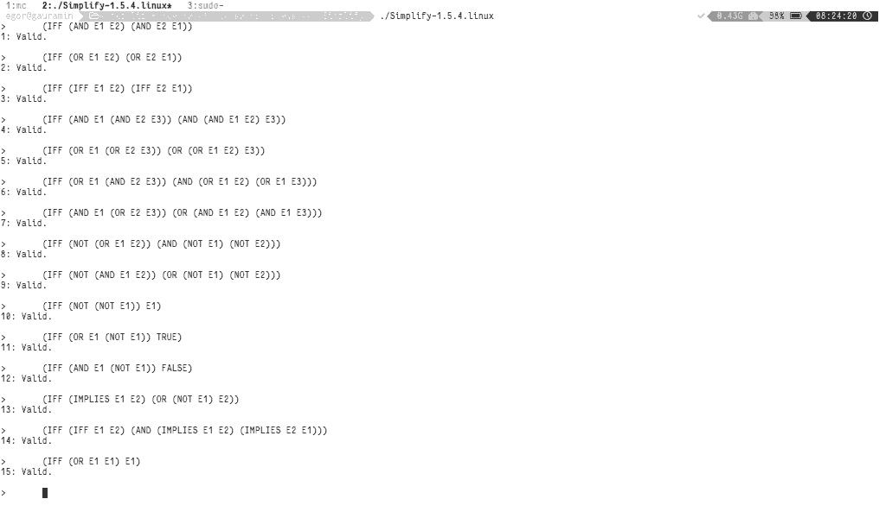
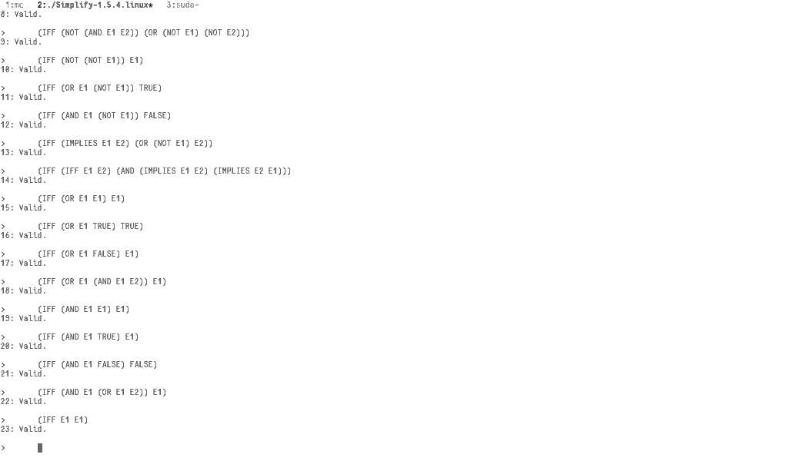
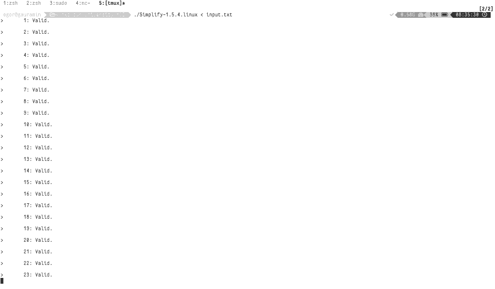

# Звіт з лабораторної роботи за дисципліною "Математичні основи інформатики" студента групи ПА-17-2 Панасенка Єгора Сергійовича Кафедра комп’ютерних технологій, фпм, дну  2018-2019 навч.р.

## Постановка задачі

Тема: "Автоматизація доведення тавтологій за допомогою ПЗ Simplify"

Розділи лабораторної роботи.

1. Ознайомитися з ПО Simplify по документації [1].
2. Застосувати ПО Simplify для доведення тверджень
    1. заданих з консолі;
    2. вказується у програмі текстової файлі.
3. Застосувати ПО Simplify для доказу
   12 законів еквівалентності [2].

Література / Посилання

1. http://khizha.dp.ua/library/simlify/*.*
   Файл: Simplify.html
   Файл: Simplify-1.5.4.exe
2. Гріс Д. Наука програмування. - М: МИР, 1984. - 416 c.

## Хід виконання

Simplify приймає послідовність формул першого порядку в якості вхідних даних і намагається довести кожну з них. Simplify не реалізує процедуру ухвалення рішень для своїх вхідних даних: іноді вона може не підтвердити правильну формулу. Але він консервативний в тому сенсі, що ніколи не стверджує, що невірна формула вірна. [1,Simplify.html]

1. Спочатку напишемо 12 законів еквівалентності.
    1. Закони комутативності:  
       `(E1 ∧ E2) = (E2 ∧ E1)`  
       `(E1 ∨ E2) = (E2 ∨ E1)`  
       `(E1 = E2) = (E2 = E1)`  
    2. Закони асоціативності:  
       `E1 ∧ (E2 ∧ E3) = (E1 ∧ E2) ∧ E3`  
       `E1 ∨ (E2 ∨ E3) = (E1 ∨ E2) ∨ E3`  
    3. Закони дистрибутивності:  
       `E1 ∨ (E2 ∧ E3) = (E1 ∨ E2) ∧ (E2 ∨ E3)`  
       `E1 ∧ (E2 ∨ E3) = (E1 ∧ E2) ∨ (E2 ∧ E3)`  
    4. Закони де Моргана:  
       `¬(E1 ∧ E2) = ¬E2 ∧ ¬E1`  
       `¬(E1 ∨ E2) = ¬E2 ∨ ¬E1`  
    5. Закон заперечення: `¬(¬E1) = E1`  
    6. Закон виключеного третього: `E1 ∨ ¬E1 = T`  
    7. Закон протиріччя: `E1 ∨ ¬E1 = F`  
    8. Закон імплікації: `(E1 ⇒ E2) = ¬E1 ∨ E2`  
    9. Закон рівності: `(E1 = E2) = (E1 ⇒ E2) ∧ (E2 ⇒ E1)`  
    10. Закон спрощення ∨:  
        `E1 ∨ E1 = E1`  
        `E1 ∨ T = T`  
        `E1 ∨ F = E1`  
        `E1 ∨ (E1 ∧ E2) = E1`  
    11. Закон спрощення ∧:  
        `E1 ∧ E1 = E1`  
        `E1 ∧ T = E1`  
        `E1 ∧ F = F`  
        `E1 ∧ (E1 ∨ E2) = E1`  
    12. Закон тотожності: `E1 = E1`  
2. Тепер напишемо 12 законів еквівалентності синтаксисом Simplify.
    1. Закони комутативності:  
       `(IFF (AND E1 E2) (AND E2 E1))`  
       `(IFF (OR E1 E2) (OR E2 E1))`  
       `(IFF (IFF E1 E2) (IFF E2 E1))`  
    2. Закони асоціативності:  
       `(IFF (AND E1 (AND E2 E3)) (AND (AND E1 E2) E3))`  
       `(IFF (OR E1 (OR E2 E3)) (OR (OR E1 E2) E3))`  
    3. Закони дистрибутивності:  
       `(IFF (OR E1 (AND E2 E3)) (AND (OR E1 E2) (OR E1 E3)))`  
       `(IFF (AND E1 (OR E2 E3)) (OR (AND E1 E2) (AND E1 E3)))`  
    4. Закони де Моргана:  
       `(IFF (NOT (OR E1 E2)) (AND (NOT E1) (NOT E2)))`  
       `(IFF (NOT (AND E1 E2)) (OR (NOT E1) (NOT E2)))`  
    5. Закон заперечення:  
       `(IFF (NOT (NOT E1)) E1)`  
    6. Закон виключеного третього:  
       `(IFF (OR E1 (NOT E1)) TRUE)`  
    7. Закон протиріччя:  
       `(IFF (AND E1 (NOT E1)) FALSE)`  
    8. Закон імплікації:  
       `(IFF (IMPLIES E1 E2) (OR (NOT E1) E2))`  
    9. Закон рівності:  
       `(IFF (IFF E1 E2) (AND (IMPLIES E1 E2) (IMPLIES E2 E1)))`  
    10. Закон спрощення ∨:  
        `(IFF (OR E1 E1) E1)`  
        `(IFF (OR E1 TRUE) TRUE)`  
        `(IFF (OR E1 FALSE) E1)`  
        `(IFF (OR E1 (AND E1 E2)) E1)`  
    11. Закон спрощення ∧:  
        `(IFF (AND E1 E1) E1)`  
        `(IFF (AND E1 TRUE) E1)`  
        `(IFF (AND E1 FALSE) FALSE)`  
        `(IFF (AND E1 (OR E1 E2)) E1)`  
    12. Закон тотожності:  
        `(IFF E1 E1)`  
3. Перевіримо закони еквівалентності у програмі Simplify.
   
   
4. Перевіримо закони еквівалентності у програмі Simplify через вхідний файл.
   

