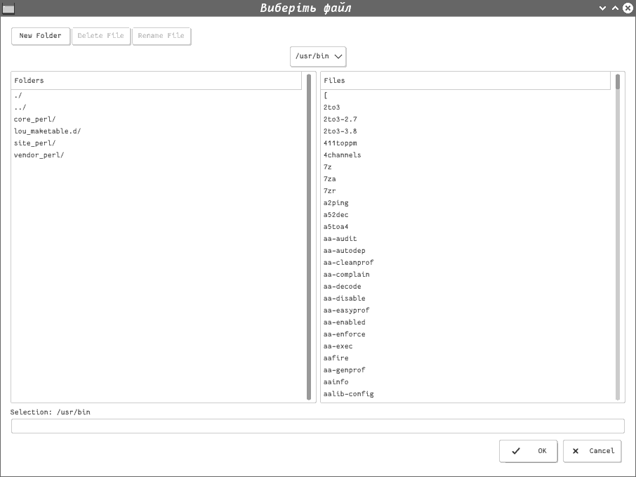

# Лабораторна робота №1, Панасенко Єгор, ПА-17-2

## Постановка задачі

Написати скрипт, який в якості першого параметра приймає ім'я директорії, з якої будуть запускатися файли. Якщо у вказаній директорії є виконуваний файл з іменем index , то необхідно запустити його на виконання. В іншому випадку, якщо в директорії існує файл index.htm, то відкрити його з допомогою програми bareview. Якщо файлу index.htm в директорії немає, але існує файл index.html, то відкрити його з допомогою gtkmoz. Якщо ж жодного з указаних файлів не виявлено, створи діалогове вікно, в якому запитати, який файл необхідно виконати. Скрипт повинен коректно виконуватись як в графічному режимі, так і без нього.

## Вихідний текст розв’язку

### Скрипт: `lab2.sh`
```shell
#!/bin/sh

DIRECTORY="$1"

[ ! -d "$DIRECTORY" ] && echo "No such directory: \"$DIRECTORY\"" && exit 1
INDEX="$DIRECTORY/index"

if [ -f "$INDEX" ]; then "$INDEX"
elif [ -f "$INDEX.html" ]; then gtkmoz "$INDEX.html"
elif [ -f "$INDEX.htm" ]; then bareview "$INDEX.htm"
else
    FILE=`Xdialog --stdout --title "Виберіть файл" --fselect "$DIRECTORY" 50 150`
    [ -f $FILE ] && $FILE
fi
exit $?
```

## Опис розв'язку

### Підготовка

Встановимо необхідне ПО. Так як робота проводилася на ОС Arch Linux,
то встановимо за допомогою такої команди:
```shell
pacman -S xdialog
```

### Розв'язок

Скрипт `lab2.sh` приймає як перший аргумент деяку директорію,
якщо цієї директорії не існує то скрипт закінчується аварійно з помилкою.
Якщо ж існує то шукає за завданням відповідний `index*` файл,
який за правилом оброблюється, якщо ж файл не знайдений запускається вікно
з вибором потрібного файлу у цій директорії,
після вибору перевіряється чи існує такий файл, якщо так то запускаємо цей файл.
Скрипт виводить з кодом виконання останньої програми.

## Опис тестових прикладів

Запустимо скрипт із неправильним аргументом:
```shell
$ "./lab2.sh" Wrong
No such directory: "Wrong"
```

Запустимо скрипт із директорією у якій існує відповідний `index*` файл.
На екран виводиться вивід відповідної програми.

Запустимо скрипт із директорією у якій не існує відповідний `index*` файл,
наприклад директорію `/usr/bin`.
Тоді отримаємо такий екран:



Якщо виберемо будь-який, то далі вивід буде таким же як і
у попередньому випадку.
