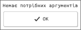
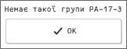
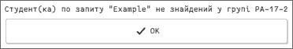

# Лабораторна робота №3, Панасенко Єгор, ПА-17-2

## Постановка задачі

Написати скрипт, який використовує програму gtkdialog3/gtkdialog2. Вхідні параметри: група та ФІП студента. Необхідно перевірити, чи існує файл з іменем групи, якщо існує, тоді необхідно перевірити, чи студент з вказаним іменем навчається в цій групі. Видати відповідне повідомлення користувачу.

## Вихідний текст розв’язку

### Скрипт: `lab3.sh`
```shell
#!/bin/sh

TEMPLATE="<vbox><text><label>MESSAGE</label></text><button ok></button></vbox>"

[ -z "$1" ] || [ -z "$2" ] && {
    MAIN_DIALOG=${TEMPLATE/MESSAGE/Немає потрібних аргументів} gtkdialog
    exit 1
}

GROUP="$1"
FILE="$GROUP.txt"
QUERY="$2"

if [ -f "$FILE" ]
then
    STUDENT=`grep "$QUERY" "$FILE" | head -n 1`
    if [ -z $STUDENT ]; then MAIN_DIALOG=${TEMPLATE/MESSAGE/Студент(ка) по запиту \"$QUERY\" не знайдений у групі $GROUP} gtkdialog
    else MAIN_DIALOG=${TEMPLATE/MESSAGE/Студент(ка) \"$STUDENT\" належить групі $GROUP} gtkdialog
    fi
else MAIN_DIALOG=${TEMPLATE/MESSAGE/Немає такої групи $GROUP} gtkdialog
fi
```

## Опис розв'язку

### Підготовка

Встановимо необхідне ПО. Так як робота проводилася на ОС Arch Linux,
то встановимо за допомогою такої команди:
```shell
pacaur -S gtkdialog vte-legacy
```

### Розв'язок

Скрипт `lab3.sh` приймає як перший аргумент назву групи та за другий аргумент
деякий запит на пошук студента. Якщо ці аргументи відсутні то програма виходить
з помилкою. Далі виконуються відповідні перевірки та виводиться на екран
відповідне повідомлення.

## Опис тестових прикладів

Нехай запустимо скрипт без аргументів, тоді отримаємо таке вікно:



Запустимо скрипт з неправильною групою, файл якої не існує. Наприклад
`./lab3.sh PA-17-3 Пан`, тоді отримаємо таке вікно:



Запустимо скрипт із студентом який не в групі. Наприклад
`./lab3.sh PA-17-2 Example`, тоді отримаємо таке вікно:



Запустимо скрипт із студентом який є у групі. Наприклад
`./lab3.sh PA-17-2 Пан`, тоді отримаємо таке вікно:


