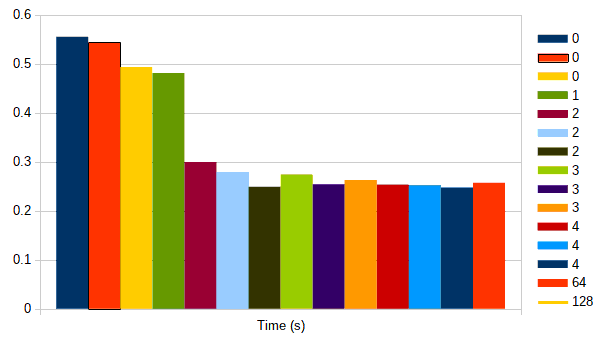

# Звіт з лабораторної роботи №1<br>за дисципліною "Паралельні та розподілені обчислення"<br>студента групи ПА-17-2<br>Панасенка Єгора Сергійовича<br>Кафедра комп'ютерних технологій<br>ФПМ, ДНУ, 2017-2018 навч.р.

Повний проект можна знайти тут: https://github.com/gaurapanasenko/unilab/tree/master/07/PaDC_Lab1

## Постановка задачі. Використання OpenMP

* Напишіть програму на мові C для обчислення скалярного добутку двох векторів типу `double`.  
Розмір векторів виберіть таким чином, щоб вони займали половину оперативної пам'яті.
* Модифікуйте даний алгоритм за допомогою прагми OpenMP і виконайте програму з використанням різної кількості нитей.
* Обчисліть час виконання і проаналізуйте отримані результати.

## Опис розв'язку

Для чистоти експерименту спочатку створимо програму `generator`, яка згенерує вектор необхідного розміру, та виведе у стандартний потік виводу наш вектор. Ця програма приймає як перший аргумент розмір вектору у мебібайтах (далі MiB). Для компактності файлів ми будемо зберігати файл у бінарному вигляді, таким чином ми ще зможемо перевірити чи створені вектори мають правильний розмір, тобто будуть розмір файлу буде відповідати розміру пам'яті використаної вектором.

Далі створимо програми `main_simple` та `main_openmp`, котрі будуть приймати на стандартний потік вводу, наші вектори, а виводити результат, та час обчислення скалярного добутку.

## Отримані результати

Наведемо графік залежності часу виконання від кількості потоків.



## Вихідний текст

### Файл `common.h`

```c
#ifndef COMMON_H
#define COMMON_H
#include <stdio.h>
#include <stdlib.h>
#include <math.h>
#include <time.h>

#define size_type int
#define type double

static const int SIZE_OF_SIZE = sizeof(size_type);
static const int SIZE_OF_ITEM = sizeof(type);

static const int UNIT = 1024 * 1024; // MiB
static const int MAX_VALUE = 16;
static const int DIVIDER = RAND_MAX / MAX_VALUE;

int main_template(void func(size_type, type*, type*, type*));

#endif // COMMON_H
```

### Файл `common.c`

```c
#include <sys/time.h>
#include "common.h"

int main_template(void func(size_type, type*, type*, type*))
{
    size_type size, i, x;
    type *a, *b, dot_product = 0;
    struct timeval begin, end;

    fread(&size, SIZE_OF_SIZE, 1, stdin);

    a = malloc(size * SIZE_OF_ITEM);
    b = malloc(size * SIZE_OF_ITEM);

    fread(a, SIZE_OF_ITEM, size, stdin);

    fread(&i, SIZE_OF_SIZE, 1, stdin);
    if (i != size) {
        fprintf(stderr, "Vectors has different sizes, first have %i, second %i\n",
                size, i);
        free(a);
        free(b);
        return 1;
    }

    fread(b, SIZE_OF_ITEM, size, stdin);

    x = (8 > size) ? size : 8;
    fprintf(stderr, "Size is %i, first %i elements of first vector:\n", size, x);
    for (i = 0; i < x; i++) {
        fprintf(stderr, "%lf ", a[i]);
    }
    fprintf(stderr, "\nFirst %i elements of second vector:\n", x);
    for (i = 0; i < x; i++) {
        fprintf(stderr, "%lf ", b[i]);
    }
    fprintf(stderr, "\n");

    gettimeofday(&begin, NULL);
    func(size, a, b, &dot_product);
    gettimeofday(&end, NULL);

    fprintf(stderr, "Dot product of vectors equals %lf, execution time is %lf seconds\n",
            dot_product, (double) (end.tv_usec - begin.tv_usec) / 1000000 +
                         (double) (end.tv_sec - begin.tv_sec));

    free(a);
    free(b);
    return 0;
}
```

### Файл `generator.c`

```c
#include "common.h"

int main(int argc, char **argv)
{
    if (argc != 2) {
        fprintf(stderr, "%s must have numeric argument, "
                        "that will represent size of output data is MiB\n",
                argv[0]);
        return 1;
    }
    srand(time(NULL));

    // First int value will be size of array
    size_type size = (atoi(argv[1]) * UNIT - SIZE_OF_SIZE) / SIZE_OF_ITEM, i;
    type a;

    fprintf(stderr, "Size is %i, size of item is %i bytes, "
                    "size of size is %i bytes\nFirst 8 elements:\n",
            size, SIZE_OF_ITEM, SIZE_OF_SIZE);

    fwrite(&size, SIZE_OF_SIZE, 1, stdout);
    for (i = 0; i < size; i++) {
        a = ((type)rand()) / DIVIDER;
        if (i < 8)
            fprintf(stderr, "%lf ", a);
        fwrite(&a, SIZE_OF_ITEM, 1, stdout);
    }
    fprintf(stderr, "\n");

    return 0;
}
```

### Файл `main_simple.c`

```c
#include <math.h>
#include "common.h"

void func(size_type size, type *a, type *b, type *dot_product) {
    size_type i;
    type dp = 0;
    for (i = 0; i < size; i++)
        dp += sqrt(a[i] * b[i]);
    *dot_product = dp;
}

int main()
{
    return main_template(func);
}
```

### Файл `main_openmp.c`

```c
#include <omp.h>
#include <math.h>
#include "common.h"

void func(size_type size, type *a, type *b, type *dot_product) {
    size_type i;
    type dp = 0;
#pragma omp parallel for shared(a, b, size) private(i) reduction(+:dp)
    for (i = 0; i < size; i++)
        dp += sqrt(a[i] * b[i]);
    *dot_product = dp;
}


int main(int argc, char **argv)
{
    if (argc != 2) {
        fprintf(stderr, "%s must have numeric argument, "
                        "that will represent number of threads\n",
                argv[0]);
        return 1;
    }
    omp_set_dynamic(0);
    omp_set_num_threads(atoi(argv[1]));
    return main_template(func);
}
```
