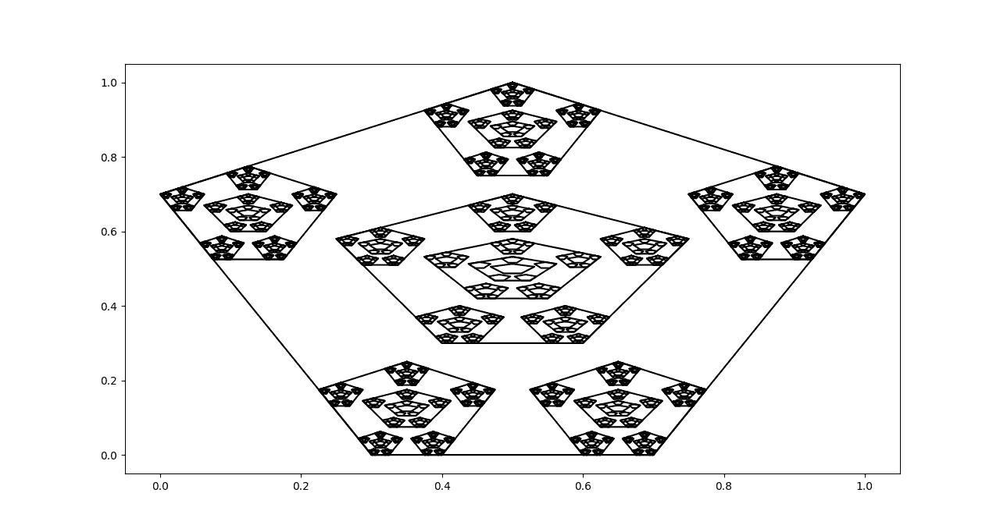

# Звіт з лабораторної роботи №1<br />за дисципліною "Елементи хаотичної динаміки"<br />студента групи ПА-17-2<br />Панасенка Єгора Сергійовича<br />Кафедра комп'ютерних технологій<br />ФПМ, ДНУ, 2017-2018 навч.р.<br />

# Постановка задачі

Розробити алгоритм, реалізуючий систему ітерованих функцій (СІФ) виду:


Для даних  побудувати перетворення Хатчинсона 

=T_1(E)\cup\dots\cup%20T_n(E))

де коіфіцієнти стискання выдображенб  вибираються строго меншими за 1. У якості вихідної множини E можна взяти будь яку плоску обмежену фігуру (трикутник, квадрат, прямокутник).

# Iлюстрації фракталів





# Код програми

```python
#!/usr/bin/env python3

fractals = [
    [[ # TRIANGLES
        [[[0.5,0], [0,0.5]], [0,   0  ]],
        [[[0.5,0], [0,0.5]], [0.5, 0  ]],
        [[[0.5,0], [0,0.5]], [0  , 0.5]],
    ], [[0,0], [1,0], [0,1], [0,0]], 6],
    [[ # QUADS
        [[[0.4,0], [0,0.4]], [0,   0  ]],
        [[[0.4,0], [0,0.4]], [0.6, 0  ]],
        [[[0.4,0], [0,0.4]], [0  , 0.6]],
        [[[0.4,0], [0,0.4]], [0.6, 0.6]],
    ], [[0,0], [1,0], [1,1], [0,1], [0,0]], 4],
    [[ # ARROW
        [[[0.3,0], [0,0.3]], [0,     0   ]],
        [[[0.3,0], [0,0.3]], [0.525, 0   ]],
        [[[0.3,0], [0,0.3]], [0.7,   0.35]],
        [[[0.3,0], [0,0.3]], [0,     0.7 ]],
        [[[0.3,0], [0,0.3]], [0.525, 0.7 ]],
    ], [[0,0], [0.75,0], [1,0.5], [0.75,1], [0,1], [0,0]], 4],
    [[ # DANILA
        [[[0.25,0], [0,0.25]], [0.225,  0    ]],
        [[[0.25,0], [0,0.25]], [0.525,  0    ]],
        [[[0.25,0], [0,0.25]], [0,      0.525]],
        [[[0.25,0], [0,0.25]], [0.75,   0.525]],
        [[[0.25,0], [0,0.25]], [0.75/2, 0.75 ]],
        [[[0.5 ,0], [0,0.4 ]], [0.5/2,  0.6/2]],
    ], [[0.5,1], [1,0.7], [0.7,0], [0.3,0], [0,0.7], [0.5,1],], 4],
    [[ # DANILA OUT
        [[[0.4,0], [0,0.4]], [ 0.3, -0.1]],
        [[[0.4,0], [0,0.4]], [-0.1,  0.1]],
        [[[0.4,0], [0,0.4]], [ 0.7,  0.1]],
        [[[0.4,0], [0,0.4]], [ 0.3,  0.3]],
        [[[0.4,0], [0,0.4]], [ 0.0,  0.6]],
        [[[0.4,0], [0,0.4]], [ 0.6,  0.6]],
    ], [[0.5,1], [1,0.7], [0.7,0], [0.3,0], [0,0.7], [0.5,1],], 4],
]

import matplotlib.pyplot as plt
import numpy as np

def arr(*args): return np.array(*args, dtype="float32")

def plot_fractal(shape, t, iterations):
    s = [shape]
    for i in range(iterations + 1):
        for j in s:
            plt.plot([k[0] for k in j], [k[1] for k in j], color="black")
        if i < iterations:
            s = [[l[0].dot(k) + l[1] for k in j] for l in t for j in s]
    plt.show()

for t, s, i in fractals:
    plot_fractal([arr(j) for j in s], [(arr(a), arr(b)) for a, b in t], i);
```
