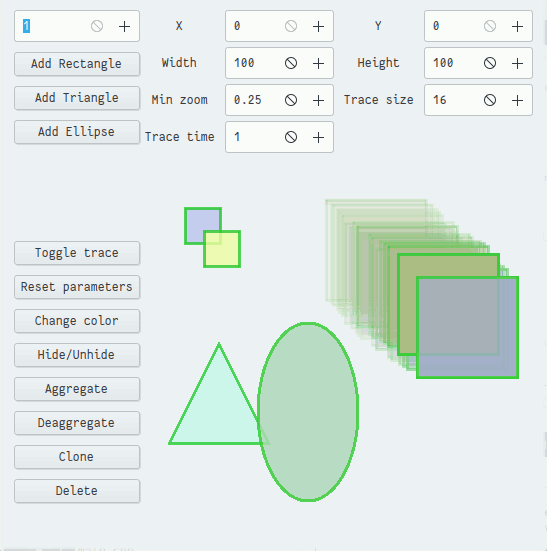

# Laboratory work 3

This work has one GUI program based on GTKMM.

Program can operate with multiple shapes (triangles, rectangles and circles). It can:

1. Create multiple new shapes
2. Clone it
3. Delete it
5. Change color for current shape
4. Toggle visibility of shape
6. Return default parameters
7. Toggle trace of shape
8. Change color when intersecting
9. Changes size of shape on edge of border area and when intersecting
10. Change size by mouse scroll
11. Aggregate and deaggregate shapes
12. Moving shapes with mouse

In future program will support saving/restoring current state of shapes to/from file and automated motion.

Source files description:

1. CMakeLists.txt - Compilation rules
2. main.ui - UI of window
3. main.cpp - Starts program
4. window.{h,cpp} -  Sets common behavior
5. graphics.{h,cpp} - Common useful classes for graphics
6. shape-parameters.{h,cpp} - Global class for all parameters
7. shapes.{h,cpp} - Shape class and smart shape container
8. shape-childs.{h,cpp} - Certain shape drawing rules
9. aggregator.{h,cpp} - Class to create aggregations

This is a screenshot of program:

